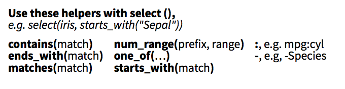

Homework 3: Tidy
================

### MDSR Exercises

Exercises 5.1, 5.2, 5.7

### Exercise 5.15

Return to one of the questions asked in an activity of the `babynames` data: which name, throughout it's history, has seen closest to a 50:50 usage rate between males and females? Answer this question by starting out by reshaping the data to separate out a column for the number of males and the separate column for the number of females.

### Exercise 5.16

Consider the following data set, which is a subset of the thermal metrics data that Aaron Till is using for his thesis.

``` r
library(tidyverse)
thermal <- read_csv("http://bit.ly/2sCVT4z")
```

You'll recognize this as a particularly untidy data set. Reshape the data so that you can create a time series plot that shows the mean surface temperate and the mean bottom temperature for each month between 1980 and 2015.

#### Advice

-   Use `select()` to slim down the data set to only the columns that you'll need. If you do this at the top of a pipe, it can save lots of computation.
-   There are a series of helper functions that you can use to select multiple columns without having to write them all out. They show up in the `dplyr` cheatsheet:



-   For advice on dealing with dates and going between strings and numbers, refer to pg. 122 and 123 of the textbook. There are multiple ways to skin this cat. Some functions that you can choose from:
    -   variety of functions in the `lubridate()` package, detailed [here](http://r4ds.had.co.nz/dates-and-times.html).
    -   `sub_str()` detailed [here](http://r4ds.had.co.nz/strings.html).
    -   `fct_recode` detailed [here](http://r4ds.had.co.nz/factors.html).
-   If you encounter oddities in the data, feel free to ask other student's advice over slack for how to handle it. Part of working with untidy data is doing the best with what you have and being sure to communicate any assumptions that you have made.
