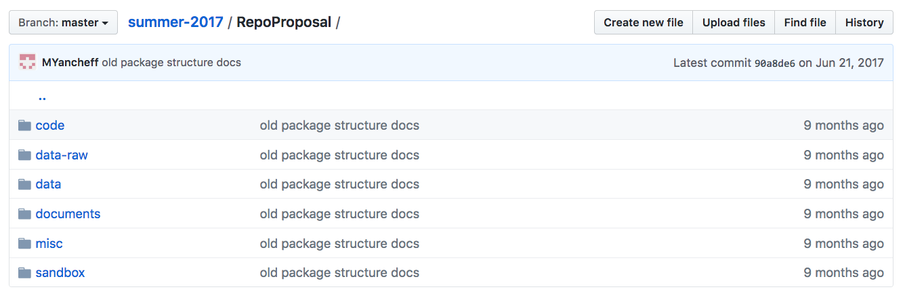

---
output:
  github_document:
    toc: true
---

# Civic Data Project

## Overview

The final project for Math 241 entails a substantial five week effort that encompasses all steps in the data science project.

# Project topic

*Civic data* is a term that is tough to pin down precisely. It is primarily used to refer to data collected by a government office that are opened to the public to signal transparency and to invite the community to take a role in learning from the data to improve the services offered by the government. It is also used more expansively to refer to data collected by community organizations and non-profits that capture some aspect of civic life.

There is no hard and fast rule about the size or scope of this project, other than it needs to be sufficiently substantial to constitute roughly half of the work for a full semester class at Reed College. For example, it is expected that your project will engage with multiple datasets that require some level of tidying and transformation. You need to produce six or more visualizations and, depending on the project, one or more statistical models.  The materials need to be communicated clearly, completely, and concisely to the instructors and, depending on the project you take on, to your "client."

All project results will need to be distributed in a GitHub repository.  Data files, if they are not stored in the repository, must be provided to the instructors via some mutually agreed upon method. Please make sure that all of your .Rmd files knit and format properly prior to submitting the final project.

### Assignment 1: Brainstorm

Think through two general domains of civic life that you're interested in studying. Examples include:

- Housing: homeprices, rents, homelessness, zoning
- Emergency: fire, EMT, earthquake preparedness
- Education: libraries, public schools, higher education, funding, staffing, student demographics, student performance.
- Environment: parks, drinking water, rivers
- Crime: police, courts, prisons
- Economics: unemployment, income
- Health: primary care, dental care, mental health
- Transportation: mass transit (trimet), highways, bicycles
- Community organization: neighborhood associations, church groups, sporting clubs, arts

There are at least three scales at which you should consider studying these domains:

- [City of Portland ](https://www.portlandoregon.gov/26003)
- [Multnomah County](https://multco.us/departments)
- [State of Oregon](http://www.oregon.gov/pages/index.aspx)

Once you have narrowed down the domain and scale that you're interested in, lay out *two questions* in each that you would like to answer. These should be questions that you're genuinely interested in. Importantly, there must also be data available for use in constructing an answer. These data might already be available online, they might require reaching out to government officials, or they might exist on another platform not immediately recognizable as a source of civic data (e.g. craigslist, twitter).

Please submit, as activity 7, these 4 questions across two domains, along with indications of the data sources that would be relevant and available. These should be pushed to GitHub by 4 pm Tuesday March 20th.

### Assignment 2: Proposal

- General theme that you wish you address
- Specific questions you may address along with your expectation of what you may find
- Relevant work
- Identify client/stakeholders and their contact information
- Describe the data
    + Source with citation
    + Data structure / size
    + Observational unit
    + Types of variables
    + Confidentiality/privacy concerns
- Vision for deliverable
    + Visualizations
    + Models
    + Data
    + Format
        + White paper (Rmd document)
        + Software (R package)
        + Website (Shiny App)
  

# Workflow

# Deliverables

The primary deliverable is a public GitHub repository that presents your investigation in a transparent and reproducible manner. This repo will showcase the 

### Deliverable formats

The project topic areas are quite open-ended, so the most effective format for communicating the results of your work will vary. Listed below are possible formats that you may use. Examples of each can be found in the project repos from last year's course.

1. White paper
2. R package
3. Website (Shiny app)

### Structure

Every repository should follow a similar structure, shown below. Also see  for examples.

#### Raw Data

This folder would contain the raw data files scraped directly from their source and unaltered, as well as the programs used to tidy them. Files that go in here are files that are not used directly in any kind of analysis. For example, in the OMV project, this file would contain the raw voter files as well as the code used to clean it into the format used for the actual analysis.

Only include data files that a) are not huge in size and that b) will not violate law or ethics to post publicly.

#### Data

This folder would contain all the files used directly in analysis or in the final project.

#### Sandbox

This folder would contain code and work that is not yet finished, corresponding to the general exploring/understanding phase of the data science work flow. Files in here will typically be code, and will be moved out of this file into the code file as they are completed and working.

#### Code

This folder would contain the code used in any analysis performed in the project. This would include the code to make visualizations, models, and any other analysis done.

#### Documents

The documents folder would contain the final analysis, or the main deliverable(s) that the repo is dedicated to.

For standard social science projects this folder would contain the final white paper, as well as a visualizations sub folder that would contain image files.

For a project more focused on building a tool, such as an r pacakge, the documents folder would contain a file that shows examples of the code being used.

#### Miscellaneous

This would contain any files that don't fit into the descriptions of the above folders.

#### Other Files (Not a Folder)

The README file will contain the information needed for someone to get a good preliminary understanding of what the project is as well as how the repo is organized. This file should contain the names of people involved, the sources of data, and a general guide for where things are stored in the repo.

# Symposium

Our Civic Data Symposium is a gathering to share what we've learned from the group projects with the wider community. The event will take place between 6 and 9 pm on Thursday May 10th in Vollum Lounge. In addition to the members of this class, the wider student/faculty/staff community will be invited, as will be members of the Portland community with an interest in civic data.

The first half of the symposium will features 5 minute presentations by each group to provide an overview of their project and their findings. This presentation will be accompanied by just two slides. The second half of the symposium will be a poster session, where groups spend time near their posters and answer questions as people circulate through the room and read the posters.

This symposium is a terrific opportunity to communicate your work to an engaged audience, many of whom will have experience working in related areas. To summarize, you will be preparing two components for this event: a 5 minute overview with 2 slides and a poster.

