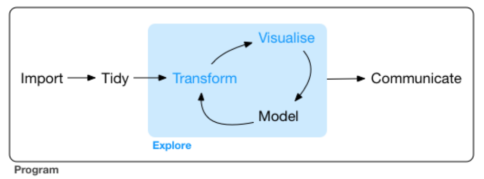

-   [Civic Data Project](#civic-data-project)
    -   [Overview](#overview)
-   [Project topic](#project-topic)
    -   [Assignment 1: Brainstorm](#assignment-1-brainstorm)
    -   [Assignment 2: Proposal](#assignment-2-proposal)
-   [Workflow](#workflow)
-   [Deliverables](#deliverables)
-   [Symposium](#symposium)

Civic Data Project
==================

Overview
--------

The final project for Math 241 entails a substantial five week effort that encompasses all steps in the data science project.

Project topic
=============

*Civic data* is a term that is tough to pin down precisely. It is primarily used to refer to data collected by a government office that are opened to the public to signal transparency and to invite the community to take a role in learning from the data to improve the services offered by the government. It is also used more expansively to refer to data collected by community organizations and non-profits that capture some aspect of civic life.

There is no hard and fast rule about the size or scope of this project, other than it needs to be sufficiently substantial to constitute roughly half of the work for a full semester class at Reed College. For example, it is expected that your project will engage with multiple datasets that require some level of tidying and transformation. You need to produce six or more visualizations and, depending on the project, one or more statistical models. The materials need to be communicated clearly, completely, and concisely to the instructors and, depending on the project you take on, to your "client."

All project results will need to be distributed in a GitHub repository. Data files, if they are not stored in the repository, must be provided to the instructors via some mutually agreed upon method. Please make sure that all of your .Rmd files knit and format properly prior to submitting the final project.

### Assignment 1: Brainstorm

Think through two general domains of civic life that you're interested in studying. Examples include:

-   Housing: homeprices, rents, homelessness, zoning
-   Emergency: fire, EMT, earthquake preparedness
-   Education: libraries, public schools, higher education, funding, staffing, student demographics, student performance.
-   Environment: parks, drinking water, rivers
-   Crime: police, courts, prisons
-   Economics: unemployment, income
-   Health: primary care, dental care, mental health
-   Transportation: mass transit (trimet), highways, bicycles
-   Community organization: neighborhood associations, church groups, sporting clubs, arts

There are at least three scales at which you should consider studying these domains:

-   [City of Portland](https://www.portlandoregon.gov/26003)
-   [Multnomah County](https://multco.us/departments)
-   [State of Oregon](http://www.oregon.gov/pages/index.aspx)

Once you have narrowed down the domain and scale that you're interested in, lay out *two questions* in each that you would like to answer. These should be questions that you're genuinely interested in. Importantly, there must also be data available for use in constructing an answer. These data might already be available online, they might require reaching out to government officials, or they might exist on another platform not immediately recognizable as a source of civic data (e.g. craigslist, twitter).

Please submit, as activity 7, these 4 questions across two domains, along with indications of the data sources that would be relevant and available. These should be pushed to GitHub by 4 pm Tuesday March 20th.

### Assignment 2: Proposal

TBA

Workflow
========

Deliverables
============

Symposium
=========
