```{r setup, include=FALSE}
knitr::opts_chunk$set(echo = TRUE)
library(tidyverse)
library(babynames)
```

# Preliminaries

## activity-3.Rmd {.build} 

- Create `activity-3.Rmd` in your in-class directory
- Use `output: github_document`
- Insert in R chunk to load `tidyverse` and `babynames`


## FYI: caching {.build}

The output of r chunks can be cached (saved) so that they don't need to be re-run
everytime you re-knit.

```{r}
#```{r compute-stuff, cache = TRUE}
# my crazy intensive computing step
#```
```

- You may want to add cached files to your .gitignore.
- Labeling chunks can help with debugging
- Many more chunk options are available (search: knitr chunk options)


# Data Wrangling

## Two paradigms {.build}

### R
```{r}
cyl4s <- mtcars[mtcars$cyl == 4, ]
mean(cyl4s$mpg)
```

### R with dplyr
```{r}
library(dplyr)
cyl4s <- filter(mtcars, cyl == 4)
summarize(cyl4s, mean = mean(mpg))
```


## R Subsetting {.build}

```{r}
cyl4s <- mtcars[mtcars$cyl == 4, ]
```

- Square brackets are used to subset dataframes.
- `[rows, columns]`


## R Summaries {.build}

```{r}
mean(cyl4s$mpg)
```

- Many commands operate on a *vector* (column) of data extracted from a dataframe
using the `$`.


## dplyr Subsetting {.build}

```{r}
cyl4s <- filter(mtcars, cyl == 4)
```

- `dplyr` contains separate functions to *filter* the rows and *select* the columns.
- The dataframe is one argument and the column names are another (no `$`).

```{r}
cyl4s <- mtcars %>% filter(cyl == 4)
```

- Can also *chain* commands using the pipe.


## dplyr Summaries {.build}

```{r}
summarize(cyl4s, mean = mean(mpg))
```

- Any numerical summary that you want to apply to a column of a dataframe
is specified within `summarize()`.

```{r}
cyl4s %>% summarize(mean = mean(mpg))
```

- This, too, can be put into a chain.


## Two paradigms

### R
```{r}
cyl4s <- mtcars[mtcars$cyl == 4, ]
mean(cyl4s$mpg)
```

### R with dplyr
```{r}
library(dplyr)
cyl4s <- filter(mtcars, cyl == 4)
summarize(cyl4s, mean = mean(mpg))
```


## Why dplyr? {.build}

Data sets are often of high *volume* (lots of rows) and high *variety* (lots
of columns). This is overwhelming to visualize and analyze, so we find ourselves
chopping the data set up into more manageable and meaningful chunks. We also 
often need to perform operations to organize and clean our data.

This is all possible in base R, but with `dplyr`, it is **simple**, **readible**, 
and **fast**.


## The Five Verbs {.build}

- `select()`
- `filter()`
- `mutate()`
- `arrange()`
- `summarize()`


## Philosophy {.build}

- Each verb takes a data frame and returns a data frame
    + actually a `tbl_df`
    + allows chaining with `%>%`
- Idea:
    + master a few simple commands
    + use your creativity to combine them
- Cheat sheet:
    + https://rstudio.com/resources/cheatsheets

## `select()`

Subset the columns.

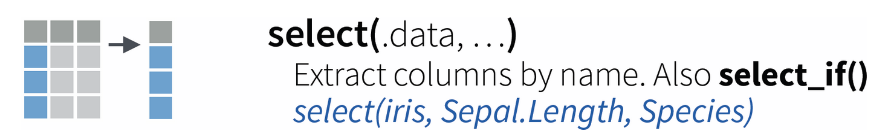


## `filter()`

Subset the rows.

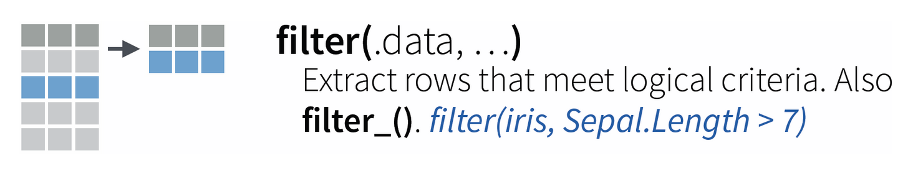


## `mutate()`

Add or modify a column.

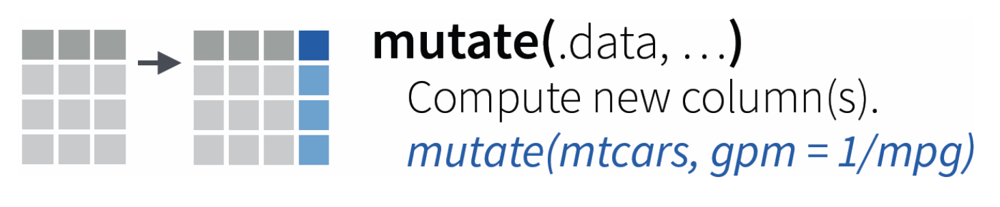


## `rename()`

Rename a column.

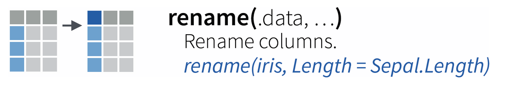


## `arrange()`

Sort the rows.

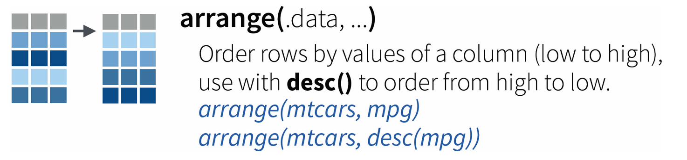


## `summarize()`

Summarize column(s) into a single row.

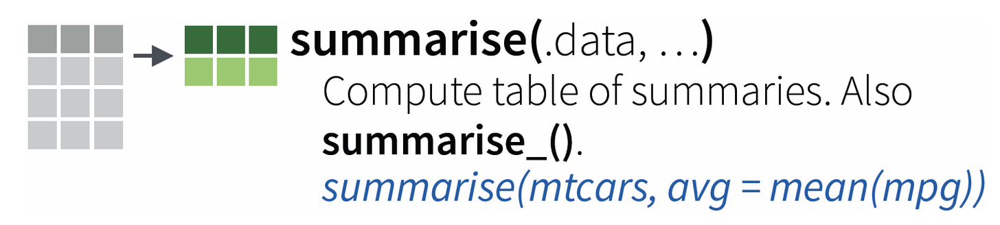


## Activity 3.1

- Add a new column to `babynames` that indicates whether or not the name proportion
in that yearxgender was greater than 1%. Call that column `is_popular`.
- Which are the least popular "popular" names?


## Activity 3.1

- Add a new column to `babynames` that indicates whether or not the name proportion
in that yearxgender was greater than 1%. Call that column `is_popular`.
- Which are the least popular "popular" names?

```{r}
babynames %>%
  mutate(is_popular = prop > .01) %>%
  filter(is_popular == TRUE) %>%
  arrange(prop)
```


## Activity 3.2

- Create a new object called `bella` that contains all instances of babies named
"Bella" and all of the variables except `prop`.
- What `class()` is this object?
- Create a plot of the popularity of Bella over time.


## Activity 3.2

- Create a new object called `bella` that contains all instances of babies named
"Bella" and all of the variables except `prop`.
- What `class()` is this object?
- Create a plot of the popularity of Bella over time.

```{r}
bella <- babynames %>%
  select(year, sex, name, n) %>%
  filter(name == "Bella")
```

or

```{r}
bella <- babynames %>%
  select(-prop) %>%
  filter(name == "Bella")
class(bella)
```


## 

```{r}
babynames %>%
  select(year, sex, name, n) %>%
  filter(name == "Bella") %>%
  ggplot(aes(x = year, y = n)) + 
  geom_line(aes(color = sex))
```


# Composition

## {.vcenter}


## {.vcenter}


- Pipe (`%>%`) is provided by the `magrittr` package
- Inspired by pipe (`|`) in UNIX

## Using the pipe {.build}

The expression

```{r eval = FALSE}
mydata %>%
  verb(arg1)
```

is the same as:

```{r, eval = FALSE}
verb(mydata, arg1)
```

- It takes the output of the leading function and drops it in as the first argument of the trailing function.
- You can indicate the landing site with `.`

## Why the pipe? {.build}

Instead of having to read/write:

```{r eval = FALSE}
select(filter(mutate(data, arg1), arg2), arg3)
```

You can do:

```{r eval = FALSE}
data %>%
  mutate(arg1) %>%
  filter(arg2) %>%
  select(arg3)
```


## Coding Little Bunny Foo Foo {.build}

Nested form:

```{r eval = FALSE}
bop(scoop(hop(foo_foo, through = forest), up = field_mice, on = head))
```

With pipes:

```{r eval = FALSE}
foo_foo %>%
  hop(through = forest) %>%
  scoop(up = field_mice) %>%
  bop(on = head)
```

More on that analogy:
- https://github.com/hadley/r4ds/blob/master/pipes.Rmd


# Practice

## Activity 3.3

- Without using `summarize()` or graphics, find the year in which your name was used
most frequently.
- What was the most popular name that year?


## Activity 3.3

- Without using `summarize()` or graphics, find the year in which your name was used
most frequently.
- What was the most popular name that year?

```{r}
babynames %>%
  filter(name == "Andrew") %>%
  arrange(desc(n))
```

## Activity 3.3

- Without using `summarize()` or graphics, find the year in which your name was used
most frequently.
- What was the most popular name that year?

```{r}
babynames %>%
  filter(year == 1987) %>%
  arrange(desc(n))
```


# Aggregation

## `group_by()`

Indicate sub-groups of rows in a data set.

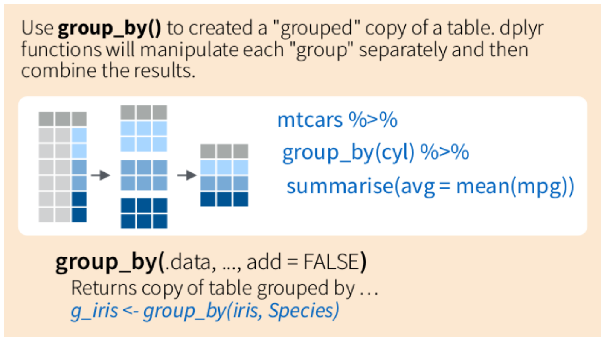


## `group_by()`

Indicate sub-groups of rows in a data set.


## 

Total number of names in each year

```{r}
babynames %>%
  group_by(year) %>%
  summarize(count = n())
```


## Activity 3.4

- Which year had the greatest number of births?
- In a single pipeline, compute the earliest and latest year that each name appears.


## Activity 3.4

- Which year had the greatest number of births?
- In a single pipeline, compute the earliest and latest year that each name appears.

```{r}
babynames %>%
  group_by(year) %>%
  summarize(num_births = sum(n)) %>%
  arrange(desc(num_births)) 
```


## Activity 3.4

- Which year had the greatest number of births?
- In a single pipeline, compute the earliest and latest year that each name appears.

```{r}
babynames %>%
  group_by(name) %>%
  summarize(earliest = min(year), latest = max(year))
```


## More . . .

Choose two of the following exercises to add to your activity and also please post a graphic to slack (the last bullet).

- **3.5**: Among popular names (let’s say at least 1% of the births in a given year), which name is the youngest—meaning that its first appearance as a popular name is the most recent?
- **3.6**: It seems like there is more diversity of names now than in the past. How have the number of names used changed over time? Has it been the same for boys and girls?
- **3.7**: Find the most popular names of the 1990s.
- **3.8**: Which names have been given to M and F most equally?
- Before class thursday, please create a visualization of this data set and post it (and it's code) to slack.


# From slack

## {.smaller}


- **Message**: there is a greater diversity of names now than in the past.
- The choice of measure matters a bit.


## {.smaller}

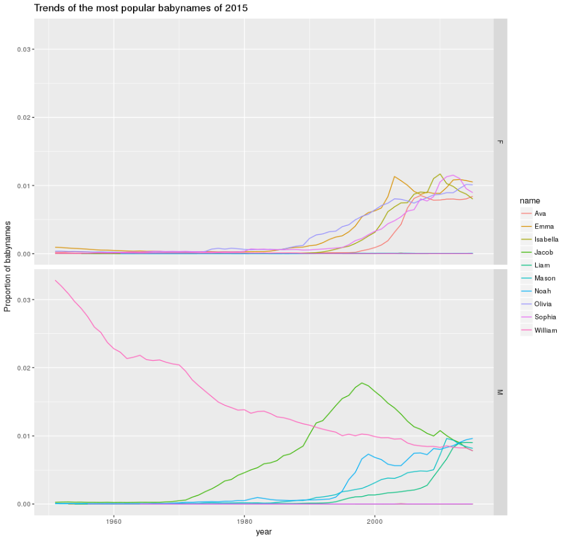

- **Message**: Most of the 2015 popular names are relatively new. Exception: William.
- Technique: focus on the long term trend of a subset that are remarkable in
a smaller time interval.


## {.smaller}

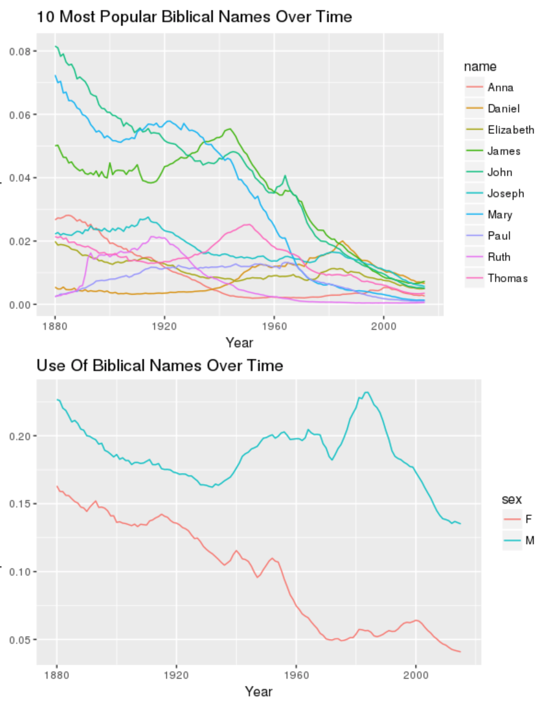

- **Message**: Biblical names are becoming rarer, though boys names got a bump 
in the second half of the 20th century.


## {.smaller}

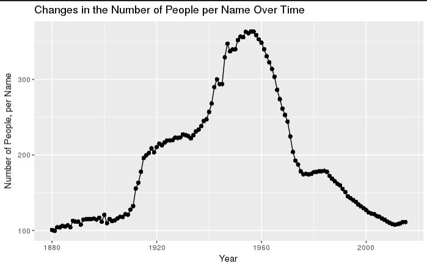

- **Message**: Control for factors that you're not interested in.
- *My curiosity here was seeing when there were the most people per name. It made sense to me that when there are less people there are less names, so I wanted to see at what era we essentially saw a population boom without a coinciding 'name quantity' boom.*


# dplyr, some notes

## `distinct()` {.build}

Return the rows with duplicate labels.

```{r}
babynames %>%
  distinct(name)
```


## So many n's

```{r eval = FALSE}
babynames %>%
  filter(name == "Jackie") %>%
  group_by(year) %>%
  summarize(n(), 
            sum(n), 
            sum(ifelse(sex == "M", n, 0)))
```

What will this return?

## So many n's

```{r}
babynames %>%
  filter(name == "Jackie") %>%
  group_by(year) %>%
  summarize(n(), 
            sum(n), 
            sum(ifelse(sex == "M", n, 0)))
```


## Add clarity with names

```{r}
babynames %>%
  filter(name == "Jackie") %>%
  rename(n_births = n) %>%
  group_by(year) %>%
  summarize(number_of_rows = n(), 
            n_total_births = sum(n_births), 
            n_boy_births = sum(ifelse(sex == "M", n_births, 0)))
```


# Joins

## Relational data

Data that resides in multiple tables with relations that link observations between pairs of tables (often not a one-one relationship!).


- Extended reading: http://r4ds.had.co.nz/relational-data.html


## 

Consider two tables with rows identified by their **key**.


## {.smaller}

```{r}
x <- tribble(
  ~key, ~val_x,
     1, "x1",
     2, "x2",
     3, "x3"
)
y <- tribble(
  ~key, ~val_y,
     1, "y1",
     2, "y2",
     4, "y3"
)
x
y
```


## {.smaller .build}

An **inner join** returns the rows that have a key in both tables, with the combined columns from both tables.


```{r}
x %>%
  inner_join(y, by = c("key" = "key"))
```


## {.smaller .build}

A **left join** returns the rows that have a key in the left table, with the combined columns from both tables, filling in NAs where there are no key matches in the right table.

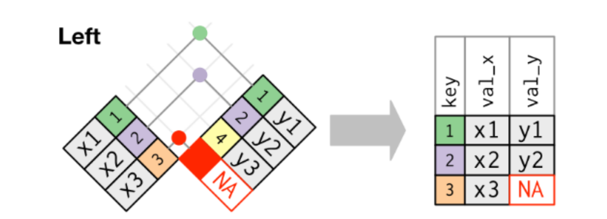

```{r}
x %>%
  left_join(y, by = c("key" = "key"))
```


## {.smaller .build}

A **right join** returns the rows that have a key in the right table, with the combined columns from both tables, filling in NAs where there are no key matches in the left table.

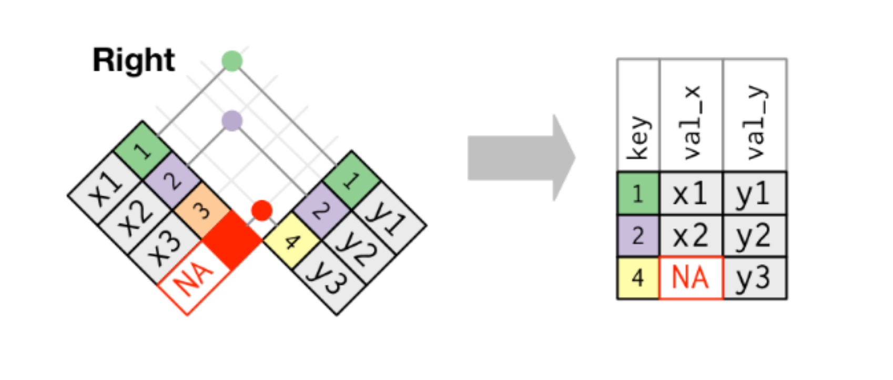

```{r}
x %>%
  right_join(y, by = c("key" = "key"))
```


## {.smaller .build}

A **full join** returns the rows that have a key either table, with the combined columns from both tables, filling in NAs where there are no key matches in the corresponding table.

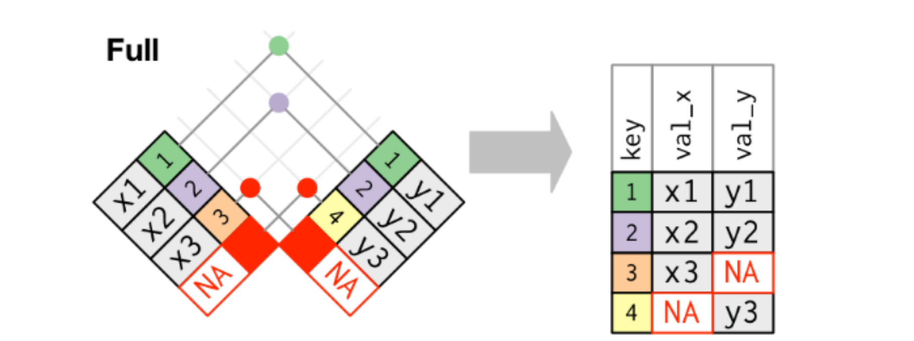

```{r}
x %>%
  full_join(y, by = c("key" = "key"))
```


## Joins as set operations

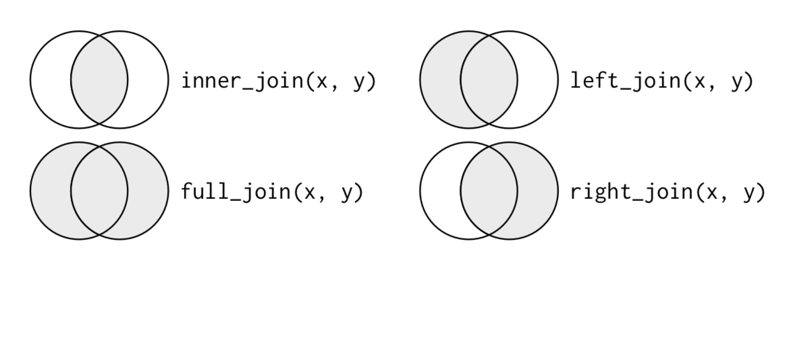

Sometimes helpful but runs into problems when keys don't uniquely identify an observation.


## Many to one {.smaller}

```{r}
x <- tribble(
  ~key, ~val_x,
     1, "x1",
     2, "x2",
     2, "x3",
     1, "x4"
)
y <- tribble(
  ~key, ~val_y,
     1, "y1",
     2, "y2"
)
x
y
```


## What type of join is this?

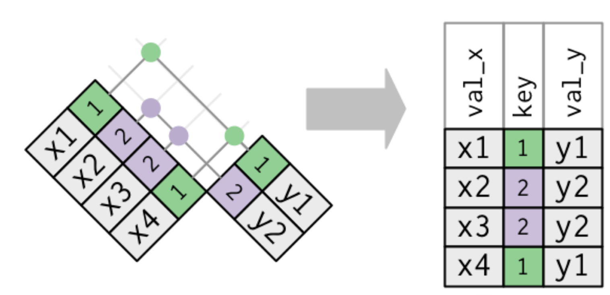


## {.smaller .build}

```{r}
x %>%
  inner_join(y, key = c("key", "key"))
x %>%
  right_join(y, key = c("key", "key"))
```


## {.smaller .build}

```{r}
x %>%
  left_join(y, key = c("key", "key"))
x %>%
  full_join(y, key = c("key", "key"))
```


# Activity 4

##

In the `babynames` package there are actually several tables. Start by renaming `births`, which has data from the US Census.

```{r}
births
census_births <- births
```


##

The `babynames` data is from the social security administration. Let's subset (to make things interesting), then get it into the same form as `census_births`.

```{r}
ssa_births <- babynames %>%
  filter(year < 2012) %>%
  group_by(year) %>%
  summarize(N = n(), births = sum(n))
```


## Activity 4 {.smaller}

- **4.1**: Create a new table using an `inner_join()`. What does this table represent? What time span is covered by this table?
- **4.2**: Create a new table using a `left_join()`. What does this table represent? What time span is covered by this table?
- **4.3**: Create a new table using a `right_join()`. What does this table represent? What time span is covered by this table?
- **4.4**: Which of the previous two tables has more missing values?
- **4.5**: Create a new table using a `full_join()`. What does this table represent? What time span is covered by this table?
- **4.6**: Using the most appropriate table, explore the fidelity between the SSA and Census counts. If they differ, why do you think this is?


