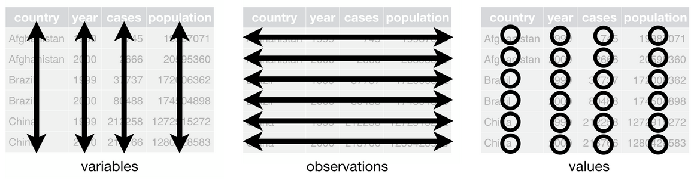
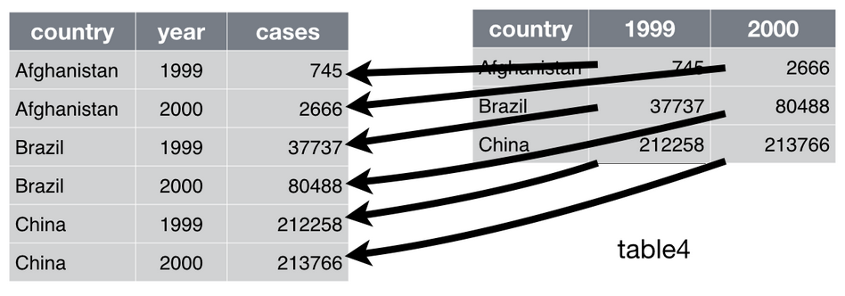
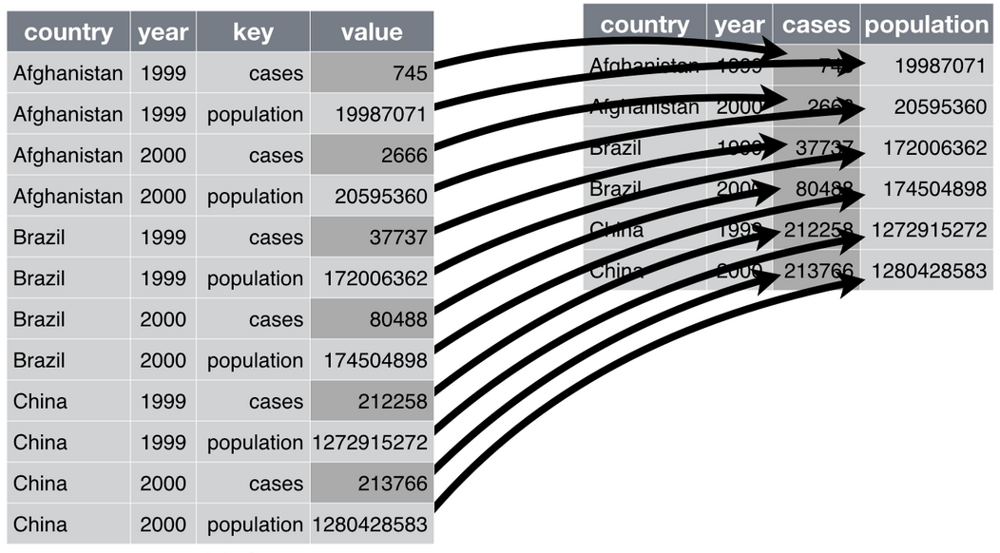

```{r setup, include=FALSE}
knitr::opts_chunk$set(echo = FALSE, warnings = FALSE, message = FALSE)
```

# Baby presidential names

## And the winner is . . .

<!-- Votes will be in for the best visualization (last problem in hw2). Start by showing top three vote getters, ask the author to describe their process, taking notes on board for "protips". Then reveal the top vote getter and award a copy of Tufte's book. -->

## Miscellaneous Announcements

- Homework 3 will be forthcoming.
- Help with crowding...

##

```{r echo = TRUE, fig.width = 2}
library(ggplot2)
ggplot(diamonds, aes(x = cut)) +
  geom_bar()
```

##

```{r echo = TRUE, fig.width = 2}
ggplot(diamonds, aes(x = cut)) +
  geom_bar() +
  theme(axis.text.x = element_text(angle = 90))
```


# Tidy Data

## Data Science Cycle {.flexbox .vcenter}


## Tidy Data

Review Handout

<!-- After they've had a chance to get down some thoughts, ask groups their answers to handout Q1 for the 4 data sets as you flip through slides on projector, recording answers on board. Then, on the whiteboard, create table of the number of commands for each data set for Q2. -->

## Data set A
```{r echo = FALSE}
library(tidyverse)
A <- table3
B <- table2
C <- table1
D1 <- table4a
D2 <- table4b
```

```{r}
A
```

## Data set B

```{r}
B
```

## Data set C

```{r}
C
```

## Data set D

```{r}
D1
D2
```


## Rules of Tidy Data {.build}



1. Each variable must have its own column
2. Each observation must have its own row
3. Each value must have its own cell


## A tidy data set {.build}

```{r}
C
```


## Untidy data {.build}

> Happy families are all alike; every unhappy family is unhappy in its own way.

**Leo Tolstoy**

> Tidy datasets are all alike, but every messy dataset is messy in its own way.

**Hadley Wickham**


## Example D1 {.build}

What is the problem? How can this be tidied?

```{r}
D1
```

- Column names are *values* not *variables*.
- We need to *gather* the columns into a new pair of variables.


## Gathering {.build}



### We need:

1. Set of columns that represent *values* (``1999``, ``2000``)
2. **key**: Name of *variable* whose values form the column names (`year`)
3. **value**: Name of *variable* whose values are spread over the cells (`cases`)

## {.build}

```{r echo = TRUE}
tidyD1 <- D1 %>%
  gather(`1999`, `2000`, key = "year", value = "cases")
tidyD1
```

### Question:
How do we form the full tidy data set C?

## {.build}

```{r echo = TRUE}
tidyD2 <- D2 %>%
  gather(`1999`, `2000`, key = "year", value = "population")
tidyD1 %>%
  left_join(tidyD2, by = c("country", "year"))
```

## Example B {.build .smaller}

What is the problem? How can this be tidied?

```{r}
B
```

- Each *observation* is spread across multiple rows.
- We need to *spread* the values of a variable across multiple columns.


## Spreading {.build}



### We need:

1. **key**: Column that contains variable names (`type`)
2. **value**: Column that contains values of multiple variables (`count`)

## {.build}

```{r echo = TRUE}
B %>%
  spread(key = "type", value = "count")
```


## Big Picture {.build}
- Are you representing your data set for **display** or **analysis**?
- If analysis, is your data tidy?
    + Each row a case
    + Each column a variable
    + Each cell a value
- If not, does it need to be reshaped to be "taller" (gathered) or "wider" (spread)

# Practice

## 

```{r eval = FALSE}
d <- read_csv("http://bit.ly/2CpOdCg")
```

##

Return to the question from Activity 3:

- **3.8**: Which names have been given to M and F most equally?

Solve by untidying `babynames`