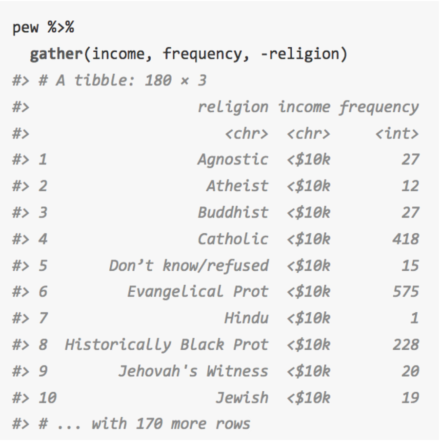
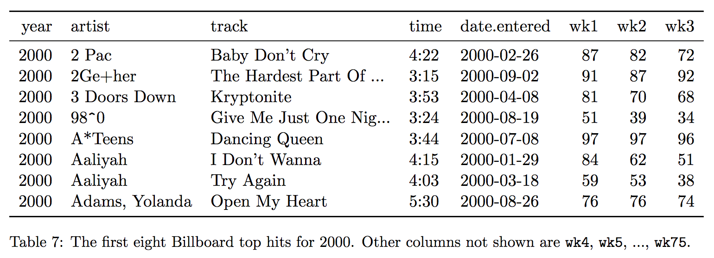
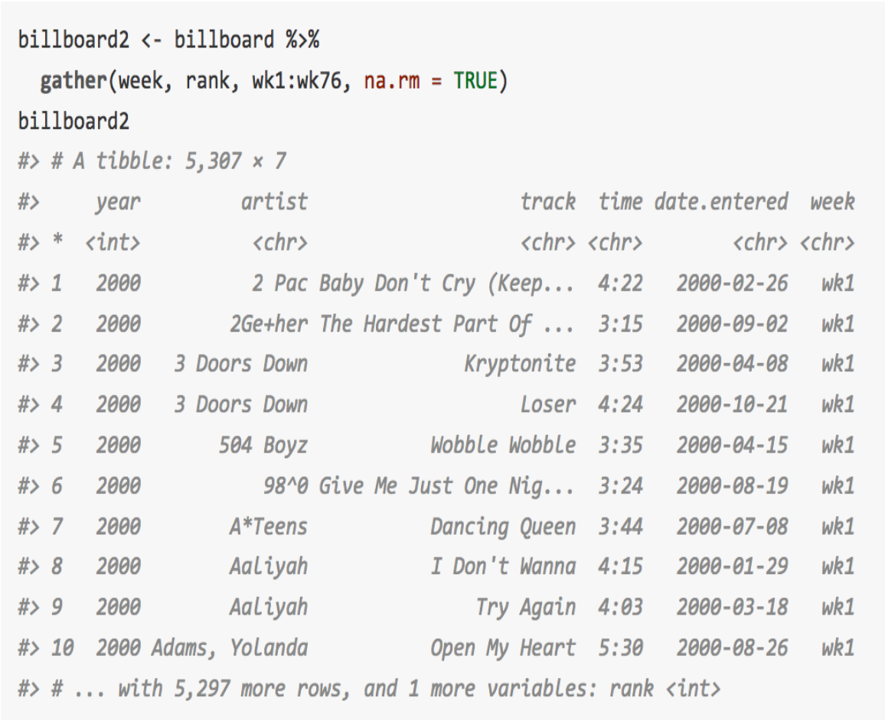
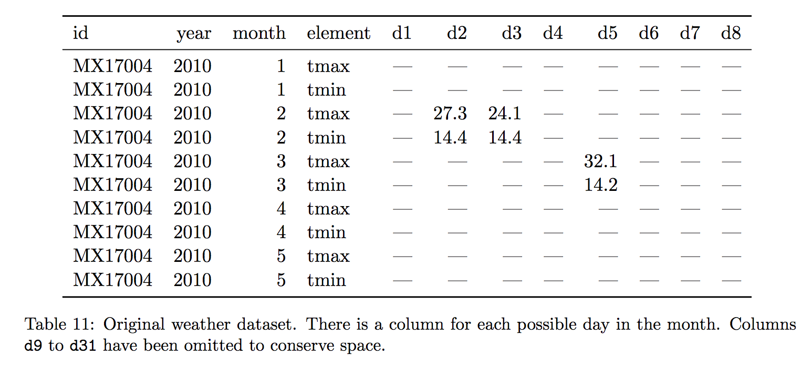
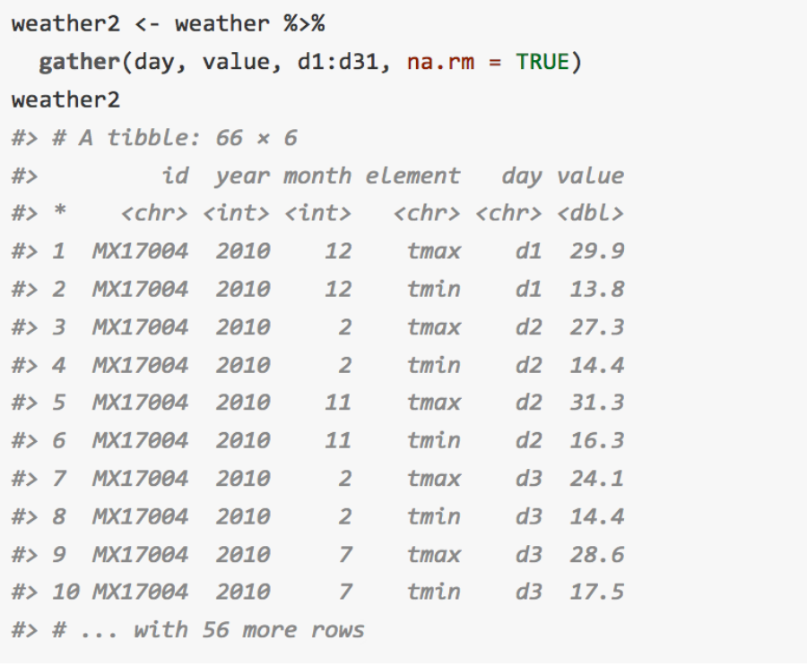
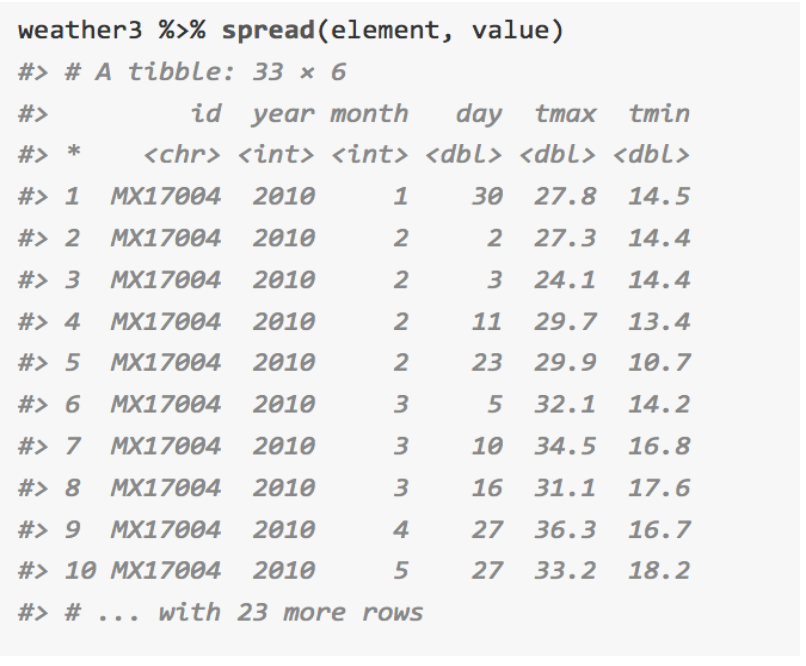
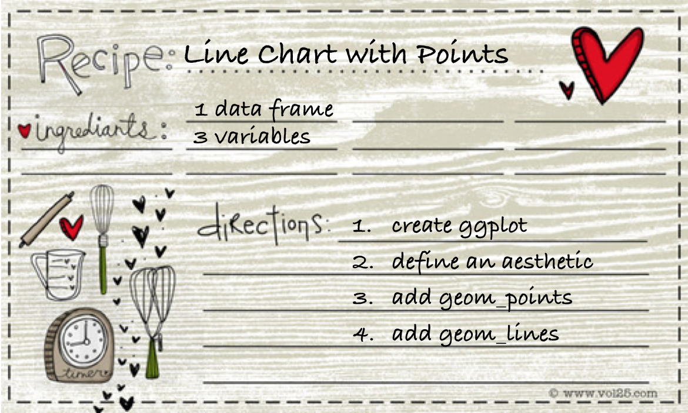
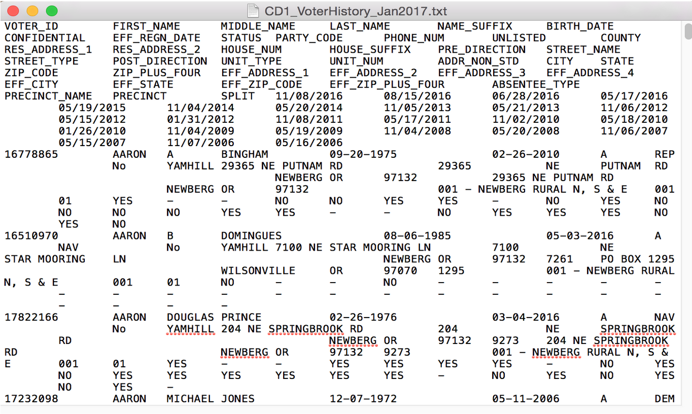
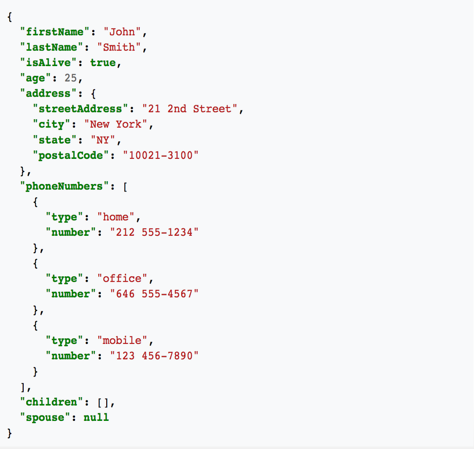

```{r setup, include=FALSE}
knitr::opts_chunk$set(warnings = FALSE, message = FALSE)
library(tidyverse)
```

# Practice with tidy data

## Ex. 1 Religion {.build}


```{r eval = FALSE}
pew %>%
  gather(2:7, key = "income_bracket", value = "count")
```

##




## Ex. 2 Billboard {.build}



```{r eval = FALSE}
billboard %>%
  gather(6:81, key = "week", value = "rank")
```

##




## Ex. 3 Weather {.build}



```{r eval = FALSE}
weather %>%
  gather(d1:d8, key = "day", value = "temp") %>%
  spread(key = "element", value = "temp")
```

##




##




# Extending tidy data 

## Extending tidy data {.build}

```{r echo = FALSE}
A <- table3
```

- If you have one column that contains two variables, they need to be `separate()`ed.
- If you have multiple columns that contain one variable, they need to be `unite()`ed.

## Separate() {.build .smaller}

```{r}
A
A %>%
  separate(rate, into = c("cases", "population"))
```


## {.build}

```{r}
A %>%
  separate(rate, into = c("cases", "population"), sep = "/")
```

## {.build}

```{r}
A %>%
  separate(rate, into = c("cases", "population"), convert = TRUE)
```

## Unite() {.build .smaller}

This is a less common operation than `separate()` (though it is needed for Exercise 5.7). Imagine you were working with this (butchered) form of data set C.

```{r echo = FALSE}
C <- table1
```

```{r}
C2 <- C %>%
  separate(year, into = c("century", "year_in_century"), sep = 2)
C2
```

We need to `unite()` the `century` and `year_in_century` columns.

##

```{r}
C2 %>%
  unite(century, year_in_century, col = "year", sep = "")
```


## Tidy data, recap {.build}

### Primary functions
- If you want to convert data from wide to long, you need to `gather()` the columns into values.
- If instead you're looking to convert from long to wide, you'll be `spread()`ing the values across the columns

### Secondary functions
- If you have one column that contains two variables, they need to be `separate()`ed.
- If you have multiple columns that contain one variable, they need to be `unite()`ed.


# Writing functions

## Functions {.build}

Do you ever find yourself with `.Rmd` files that look like this?

```{r eval = FALSE}
my_df1 %>%
  ...
  # do some stuff to my_df1
  ...

my_df2 %>%
  ...
  # do the same stuff to my_df2
  ...
  
my_df3 %>%
  ...
  # and again to my_df3
  ...
```

## For example

What if I want to draw the same kind of plot several times?

```{r eval = FALSE}
my_df1 %>%
  ggplot(aes(x = var1, y = var2, color = var3)) +
  geom_point() +
  geom_line()

my_df2 %>%
  ggplot(aes(x = varA, y = varB, color = varC)) +
  geom_point() +
  geom_line()

my_df3 %>%
  ggplot(aes(x = var1A, y = var2B, color = var3C)) +
  geom_point() +
  geom_line()
```


## What we really want




## User-defined functions

```{r eval = FALSE}
name_of_function <- function(data, var = "value") {
  . . .
  . . .
  <valid R code>
  . . .
  . . .
  return(x)
}
```

- arguments: `data`, `var`
    + `data` is required
    + `var is optional - has a default value of `"value"`
- returns:
    + by default, output of last line in function
    + here, explicitly the object `x`
    
## Scoping: global variables OK {.build}

```{r}
library(tidyverse)
my_cars <- function(mod) {
  mpg %>%
    filter(model == mod)
}
my_cars("protege")
```


## Default values {.build}

```{r}
my_cars <- function(mod = "civic") {
  mpg %>%
    filter(model == mod)
}
my_cars()
```


## Default values overridden {.build}

```{r}
my_cars("jetta")
```


## Naming arguments optional {.build}

```{r}
my_cars("camry") %>%
  head(2)
```

```{r}
my_cars(mod = "corolla") %>%
  head(2)
```


## Writing functions checklist

Pay attention to:

- names of arguments
- default argument values
- local vs global objects
- return values


## Example for real

What does this do?

```{r}
most_popular_year <- function(data, name_arg) {
  data %>%
    filter(name == name_arg) %>%
    group_by(year) %>%
    summarize(total = sum(prop)) %>%
    arrange(desc(total)) %>%
    head(1) %>%
    select(year)
}
```

## {.build}

```{r}
library(babynames)
most_popular_year(data = babynames, name_arg = "Andrew")
most_popular_year(babynames, "Andrew")
# most_popular_year("Andrew")
```


## Activity 5

For the following exercises, use the `pnwflights14` dataset.

1. Write a function that, for a given carrier identifier (e.g. DL), will retrieve the five most common airport destinations from PNW in 2014, and how often the carrier flew there.
2. Use your function to find the top five destinations for Alaska Airlines (AS).
3. Write a function that, for a given airport code (e.g. LAX), will retrieve the five most common carriers that service that airport from the PNW in 2014, and what their average arrival delay time was.


# Data Import

## Rectangular Data



## Relational Data


## Hierarchical Data



