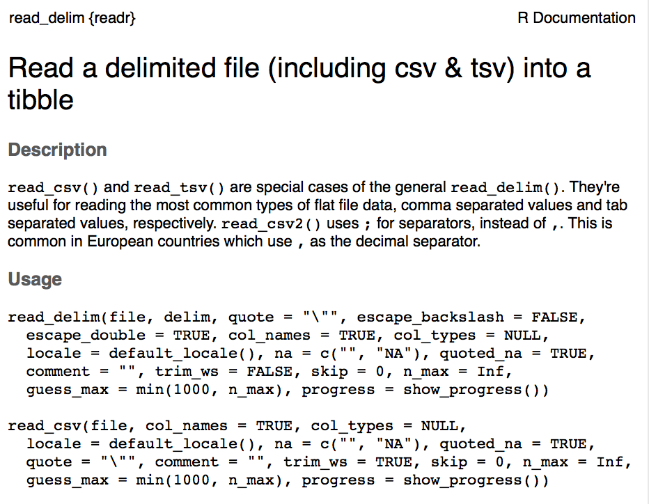
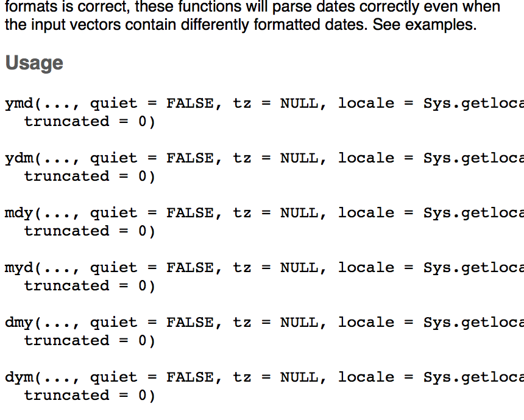

```{r setup, include=FALSE}
knitr::opts_chunk$set(warnings = FALSE, message = FALSE)
library(tidyverse)
```

# Practice with tidy data

## Ex. 1 Religion {.build}


```{r eval = FALSE}
pew %>%
  gather(2:7, key = "income_bracket", value = "count")
```

##


## Ex. 2 Billboard {.build}


```{r eval = FALSE}
billboard %>%
  gather(6:81, key = "week", value = "rank")
```

##


## Ex. 3 Weather {.build}


```{r eval = FALSE}
weather %>%
  gather(d1:d8, key = "day", value = "temp") %>%
  spread(key = "element", value = "temp")
```

##


##


# Extending tidy data 

## Extending tidy data {.build}

```{r echo = FALSE}
A <- table3
```

- If you have one column that contains two variables, they need to be `separate()`ed.
- If you have multiple columns that contain one variable, they need to be `unite()`ed.

## Separate() {.build .smaller}

```{r}
A
A %>%
  separate(rate, into = c("cases", "population"))
```


## {.build}

```{r}
A %>%
  separate(rate, into = c("cases", "population"), sep = "/")
```

## {.build}

```{r}
A %>%
  separate(rate, into = c("cases", "population"), convert = TRUE)
```

## Unite() {.build .smaller}

This is a less common operation than `separate()` (though it is needed for Exercise 5.7). Imagine you were working with this (butchered) form of data set C.

```{r echo = FALSE}
C <- table1
```

```{r}
C2 <- C %>%
  separate(year, into = c("century", "year_in_century"), sep = 2)
C2
```

We need to `unite()` the `century` and `year_in_century` columns.

##

```{r}
C2 %>%
  unite(century, year_in_century, col = "year", sep = "")
```


## Tidy data, recap {.build}

### Primary functions
- If you want to convert data from wide to long, you need to `gather()` the columns into values.
- If instead you're looking to convert from long to wide, you'll be `spread()`ing the values across the columns

### Secondary functions
- If you have one column that contains two variables, they need to be `separate()`ed.
- If you have multiple columns that contain one variable, they need to be `unite()`ed.


# Writing functions

## Functions {.build}

Do you ever find yourself with `.Rmd` files that look like this?

```{r eval = FALSE}
my_df1 %>%
  ...
  # do some stuff to my_df1
  ...

my_df2 %>%
  ...
  # do the same stuff to my_df2
  ...
  
my_df3 %>%
  ...
  # and again to my_df3
  ...
```

## For example

What if I want to draw the same kind of plot several times?

```{r eval = FALSE}
my_df1 %>%
  ggplot(aes(x = var1, y = var2, color = var3)) +
  geom_point() +
  geom_line()

my_df2 %>%
  ggplot(aes(x = varA, y = varB, color = varC)) +
  geom_point() +
  geom_line()

my_df3 %>%
  ggplot(aes(x = var1A, y = var2B, color = var3C)) +
  geom_point() +
  geom_line()
```


## What we really want


## User-defined functions

```{r eval = FALSE}
name_of_function <- function(data, var = "value") {
  . . .
  . . .
  <valid R code>
  . . .
  . . .
  return(x)
}
```

- arguments: `data`, `var`
    + `data` is required
    + `var is optional - has a default value of `"value"`
- returns:
    + by default, output of last line in function
    + here, explicitly the object `x`
    
## Scoping: global variables OK {.build}

```{r}
library(tidyverse)
my_cars <- function(mod) {
  mpg %>%
    filter(model == mod)
}
my_cars("protege")
```


## Default values {.build}

```{r}
my_cars <- function(mod = "civic") {
  mpg %>%
    filter(model == mod)
}
my_cars()
```


## Default values overridden {.build}

```{r}
my_cars("jetta")
```


## Naming arguments optional {.build}

```{r}
my_cars("camry") %>%
  head(2)
```

```{r}
my_cars(mod = "corolla") %>%
  head(2)
```


## Writing functions checklist

Pay attention to:

- names of arguments
- default argument values
- local vs global objects
- return values


## Example for real

What does this do?

```{r}
most_popular_year <- function(data, name_arg) {
  data %>%
    filter(name == name_arg) %>%
    group_by(year) %>%
    summarize(total = sum(prop)) %>%
    arrange(desc(total)) %>%
    head(1) %>%
    select(year)
}
```

## {.build}

```{r}
library(babynames)
most_popular_year(data = babynames, name_arg = "Andrew")
most_popular_year(babynames, "Andrew")
# most_popular_year("Andrew")
```


## Activity 5

For the following exercises, use the `pnwflights14` dataset.

1. Write a function that, for a given carrier identifier (e.g. DL), will retrieve the five most common airport destinations from PNW in 2014, and how often the carrier flew there.
2. Use your function to find the top five destinations for Alaska Airlines (AS).
3. Write a function that, for a given airport code (e.g. LAX), will retrieve the five most common carriers that service that airport from the PNW in 2014, and what their average arrival delay time was.


# Data Import

## Rectangular Data


## Relational Data


## Hierarchical Data


# Importing Civic Data

##

[https://data.oregon.gov/Business/New-Businesses-Registered-Last-Month/esjy-u4fc](https://data.oregon.gov/Business/New-Businesses-Registered-Last-Month/esjy-u4fc)


## Reading in data

```{r}
library(tidyverse)
biz <- read_csv("../data/New_Businesses_Registered_Last_Month.csv")
```
```{r eval = FALSE}
?read_csv
```




## Exploring structure

```{r}
str(biz)
```


## Exploring structure

```{r}
glimpse(biz)
```


## Economic trends {.build}

**Q1**: What is the trend in new business licenses over the last month?

Are these distinct businesses?

```{r}
biz %>%
  head(3)
```

## {.build}

**Q1**: What is the trend in new business licenses over the last month?

```{r}
biz <- biz %>%
    distinct(`Business Name`, .keep_all = TRUE)
biz
```


## {.build}

**Q1**: What is the trend in new business licenses over the last month?

Here is our key column:

```{r}
head(biz$`Registry Date`, 3)
class(biz$`Registry Date`)
```

But we'd like a data frame that can do this:

```{r eval = FALSE}
ggplot(biz, aes(x = date, y = count)) +
  geom_line()
```


## Data classes in R

- `integer`
- `numeric`
- `logical`
- `character`
- `factor`
-  . . . and more . . .


## Lubridate {.build .smaller}

A package to represent datetime data, do operations on it, and output it in various formats.

You can create `<date>` data using a variety of functions tailored to the format of the character string.

```{r}
library(lubridate)
ymd("2018-02-22")
mdy("February 22nd, 2018")
dmy("22-Feb-2018")
```

## Lubridate {.build .smaller}

You can create `<dttm>` (date time) data by extending the same syntax.

```{r}
mdy_hm("02/22/2018 06:26")
```

You can also cobble together a `<dttm>` from across multiple columns.

```{r eval = FALSE}
flights %>% 
  select(year, month, day, hour, minute) %>% 
  mutate(departure = make_datetime(year, month, day, hour, minute))
```

## Extracting components {.build .smaller}

Once you have data represented as a date-time, it's easy to pull out components that you're interested in.

```{r}
now <- now()
now
day(now)
hour(now)
minute(now)
```


## Extracting components {.build}

```{r}
wday(now)
wday(now, label = TRUE)
wday(now, label = TRUE, abbr = FALSE)
```


## Operations on datetimes {.build}

```{r}
joy <- mdy(04272018) - today()
class(joy)
joy
joy <- as.duration(joy)
joy
```

- Note the difference between **durations**, **periods**, and **intervals**.


## Activity 6

Use `pnwflights14` to answer the following questions.

1. Use the appropriate function to parse the following dates.
```{r}
d1 <- "January 1, 2010"
d2 <- "2015-Mar-07"
d3 <- "06-Jun-2017"
d4 <- c("August 19 (2015)", "July 1 (2015)")
d5 <- "12/30/14" # Dec 30, 2014
```
2. Using the `pnwflights14` flights data, on what day of the week should you leave `PDX` if you want to minimize the chance of a delay?


## Back to businesses {.build}

```{r}
d <- dmy(biz$`Registry Date`)
```
```{r eval = FALSE}
?dmy
```




## Lubridate {.build}

```{r}
d <- mdy(biz$`Registry Date`)
class(d)
head(d)
```


## Back to that plot {.build .smaller}

**Q1**: What is the trend in new business licenses over the last month?

First a barchart.

```{r fig.height=3}
biz <- biz %>%
  mutate(registry_date = mdy(`Registry Date`))
ggplot(biz, aes(x = registry_date)) +
  geom_bar()
```


## Back to that plot {.build .smaller}

**Q1**: What is the trend in new business licenses over the last month?

Let's try a line chart

```{r fig.height=3}
biz %>%
  group_by(registry_date) %>%
  summarize(count = n()) %>%
  ggplot(aes(x = registry_date, y = count)) +
  geom_line()
```

## Refined question {.build .smaller}

**Q2**: What is the weekly cycle in new business licenses?

```{r fig.height=3}
biz %>%
  mutate(day_of_week = wday(registry_date, label = TRUE)) %>%
  ggplot(aes(x = day_of_week)) +
  geom_bar()
```


## Analysis in review

1. Download `.csv` file
2. Upload to server
3. Read data into R
4. Remove duplicate listings
5. Reformat registry date
6. Construct plots


# Working with HTML tables


## Web scraping

Lots of interesting data lives out on the web as HTML tables.


## Rvest {.build}


An R package for harvesting HTML data.

```{r}
library(rvest)
url <- "https://www.nytimes.com/interactive/2018/sports/olympics/medal-count-results-schedule.html?smid=tw-nytimes&smtyp=cur"
url %>%
  read_html()
```


## Extracting HTML tables {.build}

```{r}
tables <- url %>%
  read_html() %>%
  html_nodes("table")
class(tables)
length(tables)
html_table(tables[[1]])
```


## What's that other table? {.build}

```{r}
html_table(tables[[2]])
```


## {.build .smaller}

Bring in medal count as data frame.

```{r}
tab1 <-html_table(tables[[1]], header = TRUE)
head(tab1, n = 3)
```

Todo: isolate the country name.

```{r}
tab1_sep <- tab1 %>%
  separate("Medal Count", 
           into = c("country","country_code"), 
           sep = -3)
head(tab1_sep)
```


## {.build}

Reshape data into tall format in preparation for `ggplot`.

```{r}
olympics <- tab1_sep %>%
  gather(Gold:Bronze, key = "medal", value = "count") %>%
  uncount(count)
olympics
```


## {.build .smaller}

Let's plot.

```{r}
olympics %>%
  ggplot(aes(x = country)) +
  geom_bar()
```


## {.build .smaller}

Long names are easier on the y-axis.

```{r}
olympics %>%
  ggplot(aes(x = country)) +
  geom_bar() +
  coord_flip()
```


## Thinking about order

There are two approaches to order the bars:

1. Manually rearrange the bars in the `ggplot()` directly.
2. Address the ordering of the names in the underlying data representation.

Let's do 2, which requires talking about `factors()`.


## Factors {.smaller .build}

Factors are a way to represent categorical data as integers that are looked up in a linked table of *levels*.

```{r}
a <- factor(olympics$country)
class(a)
levels(a)
```


##  {.smaller .build}

```{r}
tail(table(a))
```


## Adding a level {.smaller .build}

```{r}
b <- factor(olympics$country,
            levels = c(levels(a), "Oregon"))
tail(table(b))
```


## {.smaller .build}

Let's use the factor class, but then set the order of the levels based on the `Total` number of medals.

```{r}
olympics <- olympics %>%
  mutate(country = factor(country)) %>%
  mutate(country = reorder(country, Total))
levels(olympics$country)
```


## Back to the plot {.smaller .build}

```{r}
olympics %>%
  ggplot(aes(x = country)) +
  geom_bar() +
  coord_flip()
```

How can we indicate the type of medal?


## {.smaller .build}

Map the `fill` to the `medal` column.

```{r}
olympics %>%
  ggplot(aes(x = country, fill = medal)) +
  geom_bar() +
  coord_flip()
```

Now what's wrong?


## {.smaller .build}

Gotta fix the ordering of the medals.

```{r}
olympics <- olympics %>%
  mutate(medal = factor(medal, 
                        levels = c("Gold", "Silver", "Bronze")))
levels(olympics$medal)
```


## Back to the plot {.smaller .build}

```{r}
olympics %>%
  ggplot(aes(x = country, fill = medal)) +
  geom_bar() +
  coord_flip()
```

But those colors....


## Hunting for colors {.build}

Colors are represented by name (`"papayawhip"`), RBG values, or hex code.


## Changing the scale {.build}

```{r eval = FALSE}
cols <- c("Gold" = "#CFB53B",
          "Silver" = "#E6E8FA",
          "Bronze" = "#8C7853")
olympics %>%
  ggplot(aes(x = country, fill = medal)) +
  geom_bar() +
  coord_flip() +
  scale_fill_manual(values = cols) +
  theme_bw() +
  xlab("")
```


## Finished plot {.build}

```{r echo = FALSE}
cols <- c("Gold" = "#CFB53B",
          "Silver" = "#E6E8FA",
          "Bronze" = "#8C7853")
olympics %>%
  ggplot(aes(x = country, fill = medal)) +
  geom_bar() +
  coord_flip() +
  scale_fill_manual(values = cols) +
  theme_bw() +
  xlab("")
```


## Full code pt. I

```{r eval = FALSE}
url <- "https://www.nytimes.com/interactive/2018/sports/olympics/medal-count-results-schedule.html?smid=tw-nytimes&smtyp=cur"
now <- now()
tables <- url %>%
  read_html() %>%
  html_nodes("table")
olympics <- html_table(tables[[1]], header = T) %>%
  separate("Medal Count", 
           into = c("country","country_code"), 
           sep = -3) %>%
  gather(Gold:Bronze, key = "medal", value = "count") %>%
  uncount(count) %>%
  mutate(country = factor(country)) %>%
  mutate(country = reorder(country, Total)) %>%
  mutate(medal = factor(medal, levels = c("Gold", "Silver", "Bronze")))
```


## Full code pt. II

```{r eval = FALSE}
cols <- c("Gold" = "#CFB53B",
          "Silver" = "#E6E8FA",
          "Bronze" = "#8C7853")
olympics %>%
  ggplot(aes(x = country, fill = medal)) +
  geom_bar() +
  coord_flip() +
  scale_fill_manual(values = cols) +
  theme_bw() +
  xlab("") +
  labs(title = "2018 Olympic Medals", 
       subtitle = paste("(as of",
                        month(now, label = T, abbr = F),
                        day(now),
                        ")"))
```


## Final final plot

```{r echo = FALSE}
cols <- c("Gold" = "#CFB53B",
          "Silver" = "#E6E8FA",
          "Bronze" = "#8C7853")
olympics %>%
  ggplot(aes(x = country, fill = medal)) +
  geom_bar() +
  coord_flip() +
  scale_fill_manual(values = cols) +
  theme_bw() +
  xlab("") +
  labs(title = "2018 Olympic Medals", 
       subtitle = paste("(as of",
                        month(now, label = T, abbr = F),
                        day(now),
                        ")"))
```


## Analysis in review

1. Identify table of interest on the web.
2. Read in with `rvest`.
3. Find the correct table to extract as dataframe.
4. Separate, reshape, and reorder to facilitate viz.
5. Construct visualization.

**Advice**
Be wary when web scraping! It has several notable downsides:

- Violation of terms of use
- Brittle code

Best alternative: application programmer interface (API).


# Activity 6

3. Recreate the Olympic Medals plot but instead of countries, compare Americas, Europe, and Asia.
4. Find a HTML table of interest on wikipedia, bring it into R and create a visualization.
