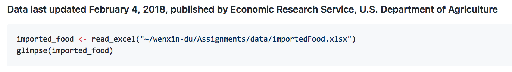
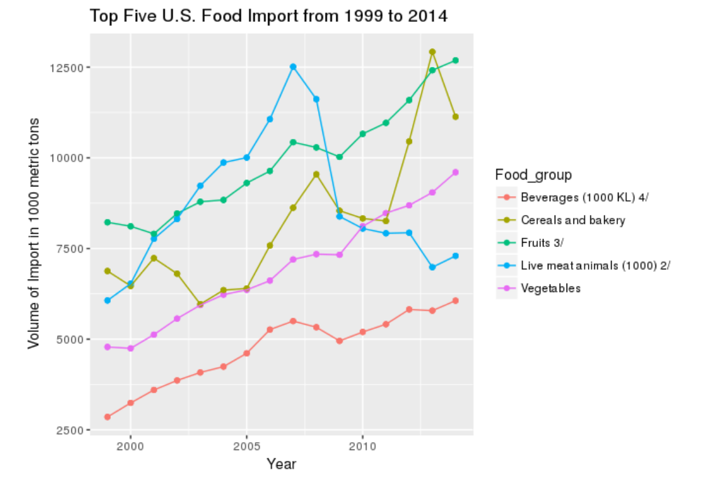
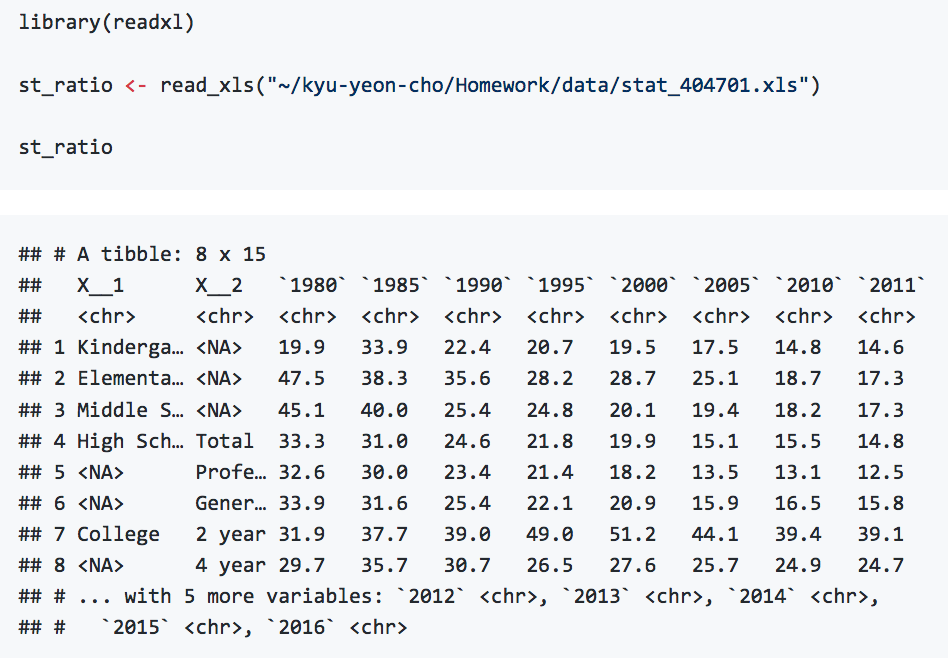
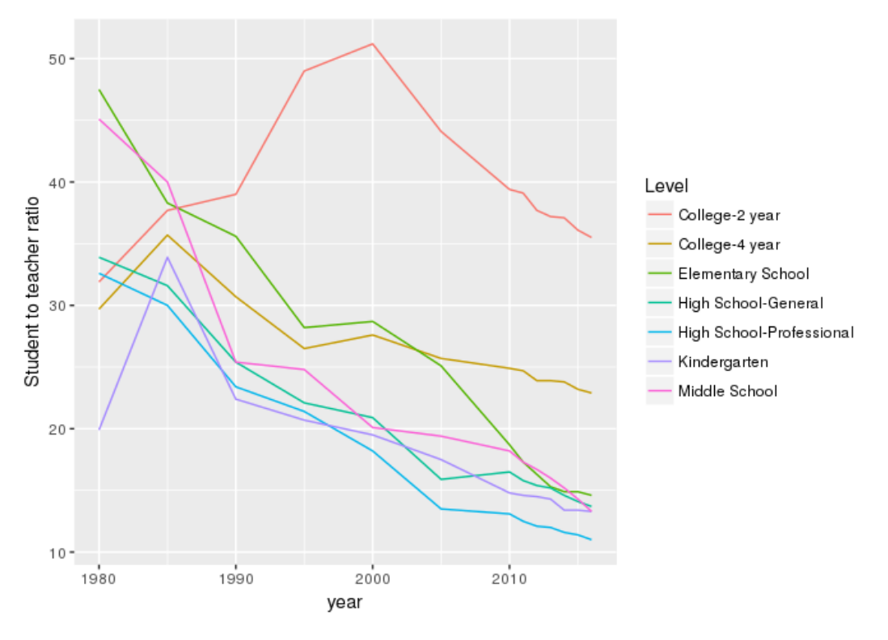
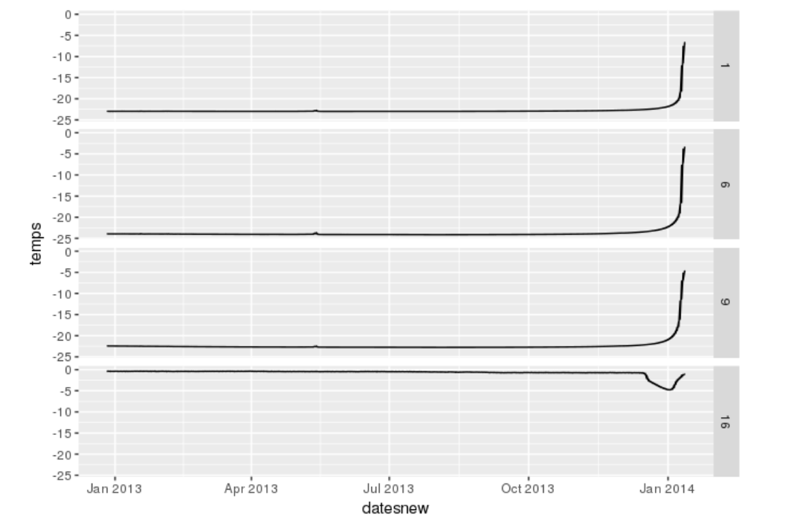
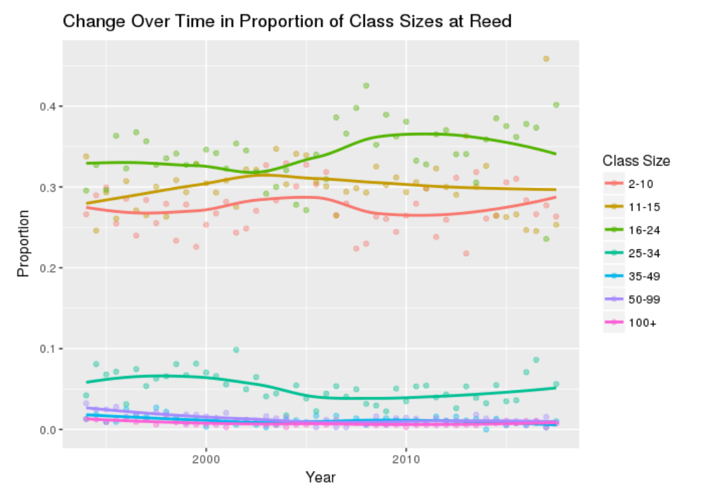
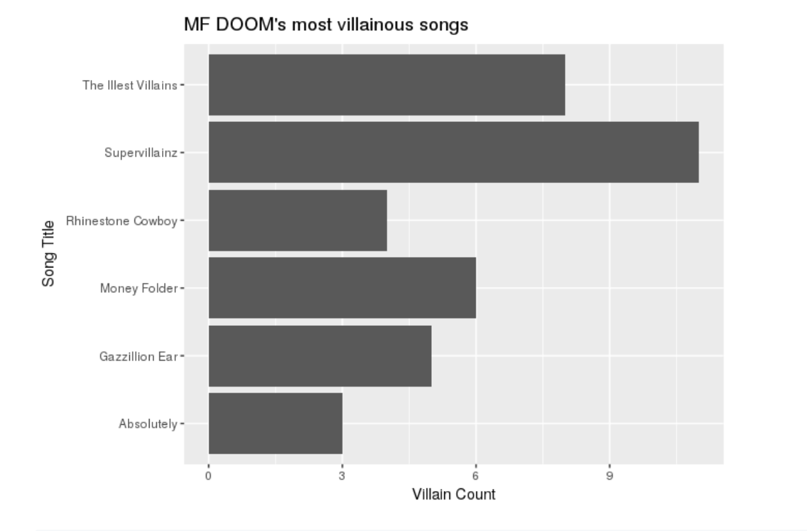

```{r setup, include=FALSE}
knitr::opts_chunk$set(warnings = FALSE, message = FALSE)
library(tidyverse)
```

# From the homework...

## Excel





## And again




## And again




## Matlab





## Stata

```{r eval = FALSE}
religion_survey <- read_dta("03255-0001-Data.dta")
```


## SPSS

```{r eval = FALSE}
library(foreign)
Womens_Marches<- read.spss("31102944.por", to.data.frame = TRUE)
```


## XML

```{r eval = TRUE}
library(rvest)
url <- "http://www.reed.edu/ir/averageclssz.html"
url %>% read_html()
```

## XML




## API


```{r eval = FALSE}
library(genius)
MFDOOM <- get_artist_songs(70)
MADVIL <- get_artist_songs(150)
KINGG <- get_artist_songs(708)
VIKTORV <- get_artist_songs(712)
# various alternate names
# this section uses the genius API to get lyrics and songs
```


## API




# Ethics

## Groups

Wenxin
Canyon
Giovanni

Frankie
Clark
Frank

Miranda
Zeki
Ryan

Henry
Katie
Richard

Simon
Josephine
Kaelyn

Ilana
Lirui
Kyu

Emerson
Mitzi
Lucas


Aaron Till


# Modeling

# Modeling diamonds

## {.build .smaller}

What is the relationship between `log(price)` and `carat`?

```{r}
ggplot(diamonds, aes(x = carat, y = log(price))) +
  geom_point(alpha = .2)
```

## {.build .smaller}

```{r}
mA <- lm(log(price) ~ carat, data = diamonds)
summary(mA)
```

Please interpret this model in a *single sentence*.

## Components of `lm()` {.build .smaller}

- Coefficient estimates: intercept, slope
- SE's on coefficients
- p-values
- Goodness of fit ($R^2$)

For *inference*, it is essentially that our model is *valid*.


## Extracting from `lm()` {.build .smaller}

```{r}
str(mA)
```


## Extracting from `lm()` {.build .smaller}

```{r}
coef(mA)
mA$coefficients
length(mA)
names(mA)
```


## Extracting from `lm()` {.build .smaller}

```{r}
head(mA$fitted.values)
head(mA$residuals)
```


## Extracting from `summary()` {.build .smaller}

```{r}
summ_mA <- summary(mA)
str(summ_mA)
```


## Extracting from `summary()` {.build .smaller}

```{r}
summ_mA <- summary(mA)
str(summ_mA)
```


## Extracting from `summary()` {.build .smaller}

```{r}
coef(summ_mA)
class(coef(summ_mA))
coef(summ_mA)[1, 3]
```


## A note about methods {.build .smaller}

There are some functions in R that behave differently depending on what types of argument
you feed them. In fact that function checked the object type then calls the appropriate method.

```{r}
plot(1:3)
```


## A note about methods {.build .smaller}

There are some functions in R that behave differently depending on what types of arguments
you feed them. In fact that function checks the object type then calls the appropriate method.

```{r}
plot(mA, 1)
```


## A better model? {.build .smaller}

```{r}
mB <- lm(log(price) ~ carat + I(carat^2), data = diamonds)
summary(mB)
```


## A better model? {.build .smaller}

```{r}
plot(mB, 1)
```


## A third model {.build .smaller}

```{r}
ggplot(diamonds, aes(x = log(carat), y = log(price))) +
  geom_point(alpha = .2)
```


## A third model {.build .smaller}

```{r}
mC <- lm(log(price) ~ log(carat), data = diamonds)
summary(mC)
```


## A third model {.build .smaller}

```{r}
plot(mC, 1)
```


## Comparing models

The choice of criterion depends on the modeling goal.

1. Predictive accuracy ($R^2_{adj}$, test-train MSE)
2. Model validity


## A different question {.build .smaller}

What is the relationship between `log(price)` and `cut`?

```{r}
mD <- lm(log(price) ~ cut, data = diamonds)
summary(mD)
```


## A different question {.build .smaller}

What is the relationship between `log(price)` and `cut` when controlling for `log(carat)`?

```{r}
mE <- lm(log(price) ~ log(carat) + cut, data = diamonds)
summary(mE)
```


## A different question {.build .smaller}

What is the relationship between `log(price)` and `cut` when controlling for `log(carat)`?

```{r}
d2 <- diamonds %>% 
  mutate(cut = factor(cut, ordered = FALSE))
mF <- lm(log(price) ~ log(carat) + cut, data = d2)
summary(mF)
```


## Summary {.build}

- Models are more extensible and formal way to describe relationships in data
- The quality of your prediction and/or inference is dependent on a wise choice of model
- Think about models as a *specific answer* to a *specific question*.
- Coefficient estimates will change based on which variables you add to the model.
- Be sure to distinguish between *statistical significance* and *practical significance*.


## Activity (in pairs)

The `SatatogaHouses` data set in the `mosaicData` package provides information on 1728 houses
that sold in Saratoga County, NY in 2006.

1. Formulate a question that can be answered with this data set.
2. Create a visualization of the data relevant to that question (using 3 - 5 variables).
3. Fit a formal linear model relevant to that question.