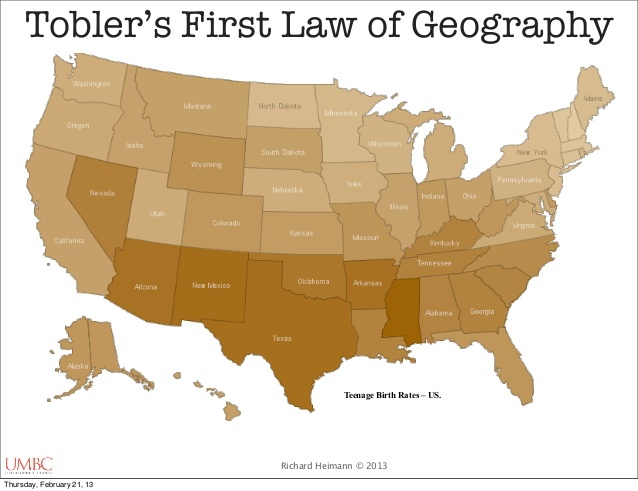
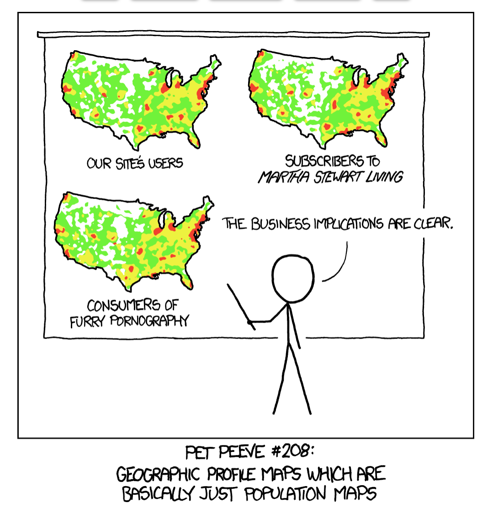
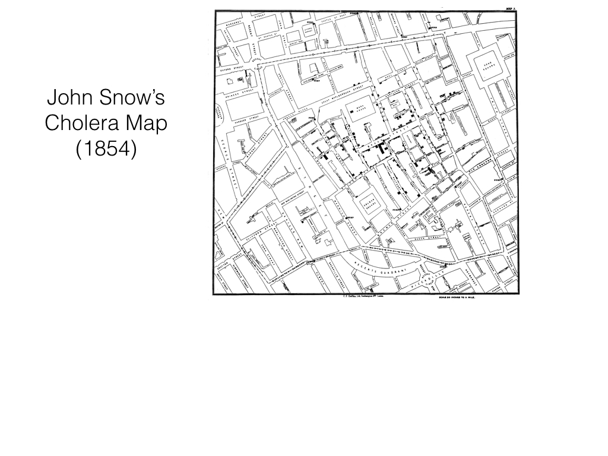
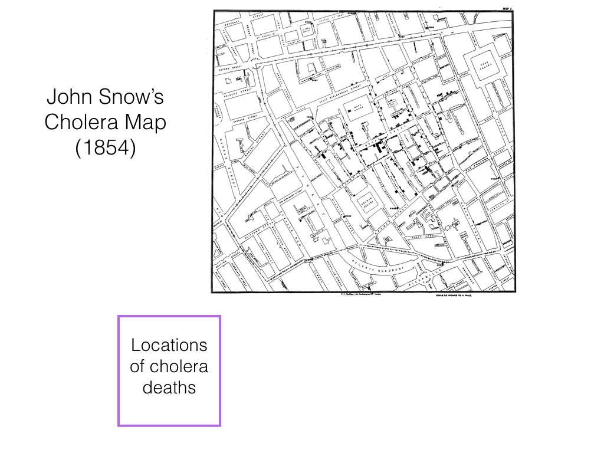
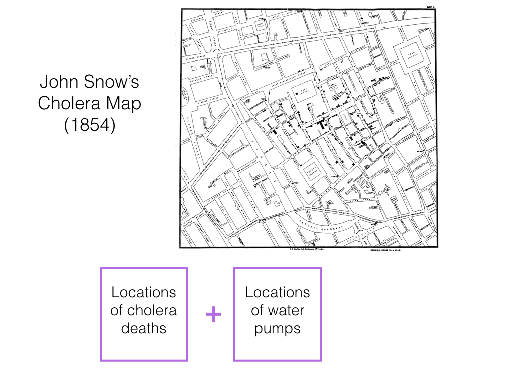
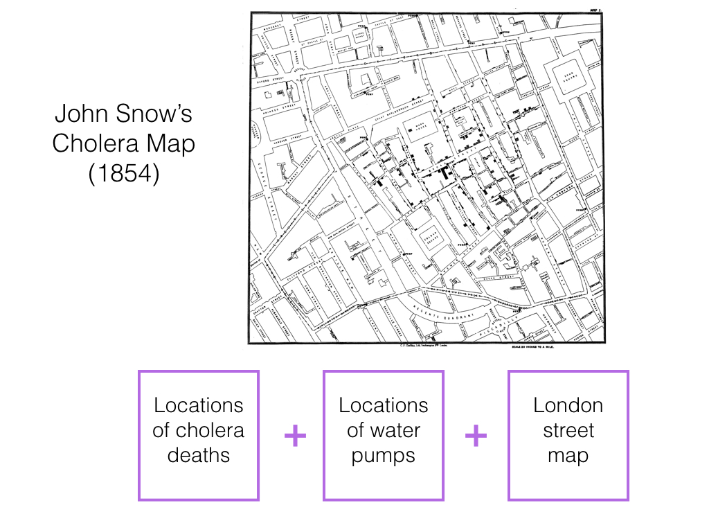

```{r setup, include=FALSE}
knitr::opts_chunk$set(warnings = FALSE, message = FALSE)
library(tidyverse)
```

## First Law of Geography

> Everything is related to everything else, but near things are more related than distant things.
>
> - Waldo Tobler


##



##


##


##


## This to be wary of

1. Does this actually need to be on a map?


##




## This to be wary of

1. Does this actually need to be on a map?
2. Is the structure in my map just another variable lurking in the background?


##




##




##




##




## Recreating Snow's Map {.build}

### Step 1

Pull in cholera deaths and pump location data.

Notes:

- Will involve *shapefiles*, which can be points, paths, lines (vector), or polygons.
- Based on ESRI's formatting (they develop ArcView GIS)
- Uses `sp` and `rgdal` packages.

DEMO


## 

```{r eval = FALSE, echo = FALSE}
library(rgdal)
dsn <- "/Users/andrewbray/Dropbox/Teaching/2018-spring/math-241/course-materials/data/snow/"

ogrListLayers(dsn)
ogrInfo(dsn, layer = "Cholera_Deaths")
cholera <- readOGR(dsn, layer = "Cholera_Deaths")
cholera
class(cholera)
summary(cholera)
plot(cholera)
str(cholera)

pumps <- readOGR(dsn, layer = "Pumps")
str(pumps)

pumps@coords
coordinates(pumps)
```

```{r echo = FALSE, message = FALSE, warning = FALSE}
library(rgdal)
dsn <- "/Users/andrewbray/Dropbox/Teaching/2018-spring/math-241/course-materials/data/snow/"
cholera <- readOGR(dsn, layer = "Cholera_Deaths")
pumps <- readOGR(dsn, layer = "Pumps")
```

## Cholera data {.build}

```{r message = FALSE}
cholera_locs <- coordinates(cholera)
head(cholera_locs)
class(cholera_locs)
cholera_locs <- as.data.frame(cholera_locs)
```


## {.build}

```{r}
library(tidyverse)
ggplot(cholera_locs, aes(x = coords.x1, y = coords.x2)) +
  geom_point()
```


## Recreating Snow's Map {.build}

### Step 2

Pull in map of London. Superimpose cholera and pump data.

Notes:

- A map involves data originally collected on the sphere.
- We need both the *basemap* as well as the *projection* that will determine how it is displayed on our 2D screen.
- We'll use `ggmap` but there are several other packages to do this step.

DEMO


##

```{r echo = FALSE, eval = FALSE}
library(ggmap)
m <- get_map("Reed College, Portland, Oregon", zoom = 17, maptype = "roadmap")
class(m)
str(m)
ggmap(m)
ggmap(m) + xlab("how far up the hill")
m <- get_map("Reed College, Portland, Oregon", zoom = 19, maptype = "satellite")
ggmap(m)

m <- get_map(location = c(lon = -122.6297, lat = 45.48105), zoom = 20, maptype = "satellite")
ggmap(m)
```


## London basemap {.build}

```{r}
library(ggmap)
m <- get_map("John Snow, London, England", zoom = 17, maptype = "roadmap")
ggmap(m)
```


## {.build}

```{r eval = FALSE}
ggmap(m) +
  geom_point(cholera_locs, aes(x = coords.x1, coords.x2))
```

This won't work: units down align.

```{r}
head(cholera_locs, n = 2)
str(m)
```


## Projections

A *projection* transforms coordinates in 3D space to coordinates in 2D space.


##

```{r message = FALSE}
library(maps)
map("world", project = "mercator", wrap = TRUE)
```

## 
```{r message = FALSE}
map("world", projection = "cylequalarea", param = 45, wrap = TRUE)
```


## Projection types {.build}

In general, projections can focus on preserving one of the following (at the expense of the other).

1. Shape/Angle: Mercator, Lambert
2. Area: Gall-Peters, Albers

Projection information and other info about the geographic data is monitored via a standardized *coordinate reference system* (CRS) using a library called PROJ.4.


## CRS {.build}

```{r message = FALSE}
library(sp)
proj4string(cholera)
```

Standard code formats:

1. *EPSG:4326* (WGS84) used by GPS and Google Earth
2. *ESPG:3857* Used for map tiles in Googe Maps, Open Street Maps, etc.
3. *ESPG:27700* (OSGB 1936) commonly used in Britain


## CRS {.build}

The basemap is actually in EPSG:4326, so let's project our cholera data into those coordinates.

```{r}
proj4string(cholera)
cholera_proj <- cholera %>%
  spTransform(CRS("+init=epsg:4326")) %>%
  as.data.frame()
cholera_proj
```


##

```{r message = FALSE, warning = FALSE}
ggmap(m) +
  geom_point(data = cholera_proj, 
             aes(x = coords.x1, y = coords.x2, size = Count))
```


## Datum {.build}

The **datum** is the point of reference of a GIS system. To fully specify how to put data on a map, you need both the projection and the datum.

Our original `cholera` data didn't have a datum specified. Some digging will show that it was meant to be in the British standard, so we set that as follows.

```{r}
proj4string(cholera) <- CRS("+init=epsg:27700")
```


## Reproject

```{r}
cholera_proj <- cholera %>%
  spTransform(CRS("+init=epsg:4326")) %>%
  as.data.frame()
```


##

```{r message = FALSE, warning = FALSE}
ggmap(m) +
  geom_point(data = cholera_proj, 
             aes(x = coords.x1, y = coords.x2, size = Count))
```


## Add in pumps

```{r}
proj4string(pumps) <- CRS("+init=epsg:27700")
pumps_proj <- pumps %>%
  spTransform(CRS("+init=epsg:4326")) %>%
  as.data.frame()
```


## Full map code

```{r eval = FALSE}
ggmap(m) +
  geom_point(data = cholera_proj, 
             aes(x = coords.x1, y = coords.x2, size = Count)) +
  geom_point(data = pumps_proj,
             aes(x = coords.x1, y = coords.x2), size = 3, color = "red", pch = 18)
```


## John Snow's Cholera Map

```{r echo = FALSE, message = FALSE, warning = FALSE}
ggmap(m) +
  geom_point(data = cholera_proj, 
             aes(x = coords.x1, y = coords.x2, size = Count)) +
  geom_point(data = pumps_proj,
             aes(x = coords.x1, y = coords.x2), size = 3, color = "red", pch = 18)
```


## 

Let's brush this up by using a basemap with a more similar aesthetic to the original.

```{r}
m <- get_map("John Snow, London, England", zoom = 17, maptype = "toner")
```


##

```{r echo = FALSE, message = FALSE, warning = FALSE}
ggmap(m) +
  geom_point(data = cholera_proj, 
             aes(x = coords.x1, y = coords.x2, size = Count), color = "steelblue") +
  geom_point(data = pumps_proj,
             aes(x = coords.x1, y = coords.x2), size = 3, color = "red", pch = 18)
```


## Homework 7

This homework to be done in pairs (but each in your own repo). Get started.


