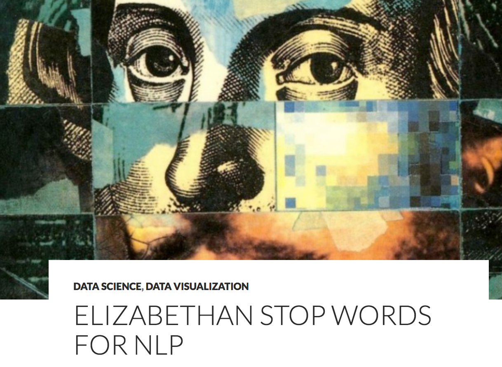
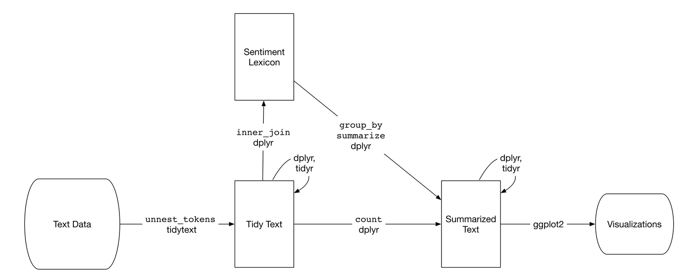

```{r setup, include=FALSE}
knitr::opts_chunk$set(warnings = FALSE, message = FALSE)
library(tidyverse)
```

# Text as data

## Working with text

- Text is an exceedingly complex form of data that is difficult to systematically analyze.
- Two common concepts:
    - *Regular expressions*
    - *Corpora*


# Regular expressions

## Case study: Shakespeare

Project Gutenberg: **www.gutenberg.org**


## Fetching Macbeth {.build}

```{r}
library(mdsr)
library(tidyverse)
macbeth_url <- "http://www.gutenberg.org/cache/epub/1129/pg1129.txt"
macbeth <- read_table("http://www.gutenberg.org/cache/epub/1129/pg1129.txt")
head(macbeth)
```


## {.build}

```{r}
slice(macbeth, 500:530)
```


## Start simple {.build}

Begin by asking very fundamental questions:

1. How long is this play?
2. How many times does Macbeth speak?
3. Who speaks the most?


## {.build}

**1. How long is the play?**

We should be able to get a decent approximation by pulling out any header and footer.

```{r}
macbeth_inner <- macbeth %>%
  slice(271:3171)
dim(macbeth_inner)
```

Can this be improved?


## {.build}

**2. How many times does Macbeth speak?**

```{r}
class(macbeth)
names(macbeth) <- NULL
macbeth <- unlist(macbeth)
class(macbeth)
head(macbeth)
```


## {.build}

**2. How many times does Macbeth speak?**

```{r}
macbeth_lines <- grep("MACBETH", unlist(macbeth), value = TRUE)
length(macbeth_lines)
head(macbeth_lines)
```


## grep(){.build}

- Global regular expression print
- R function and command-line tool
- Needle in haystack paradigm
- Patterns specified through *regular expressions*

```{r eval = FALSE}
grep(pattern = "MACBETH", x = unlist(macbeth), value = TRUE)
```

If `value = FALSE` (the default), it will return the **indices** of the matches instead of the values themselves.


## Regex {.build}

A syntax to specify a general pattern of interest in text. Often used for searching for matches to the pattern in a text document. The pattern lives inside `" "` and is build up from general elements.

- Character classes
- Quantifiers and Alternation
- Anchors


## Character classes {.build}

- `.` : any character except newline

```{r}
grep("MAC.", macbeth, value = TRUE)[1:3]
grep("MACBETH\\.", macbeth, value = TRUE)[1:3]
```

To **escape** a special character, you must use a backslash (or two in R).


## Character classes {.build}

- `.` : any character except newline
- `\w \d \s` : word, digit, whitespace

```{r}
(a <- macbeth[510])
(a <- unlist(strsplit(a, "\\.")))
grep("\\s", a, value = TRUE)
```


## Character classes {.build}

- `.` any character except newline
- `\w \d \s` : word, digit, whitespace
- `[abc]` : any of a, b, or c
- `[^abc]` : not a, b, or c
- `[a-g]` : character between a and g


## Anchors {.build}

- `^` : start of string
- `$` : end of string

```{r}
grep("me$", macbeth, value = TRUE)
```


## Anchors {.build}

- `^` : start of string
- `$` : end of string

```{r}
grep("\\sme$", macbeth, value = TRUE)
```


## Quantifiers and alternation {.build}

- `a*`: 0 or more of a
- `a+` : 1 or more of a
- `a?` : 0 or 1 of a
- `a{5}` `a{2,}` : exactly five, two or more a

```{r}
tail(grep("\\s{2,}", macbeth, value = TRUE))
```


## Quantifiers and alternation {.build}

- `a*`: 0 or more of a
- `a+` : 1 or more of a
- `a?` : 0 or 1 of a
- `a{5}` `a{2,}` : exactly five, two or more a
- `ab|cd` : match ab or cd


## Quantifiers and alternation {.build}

```{r}
grep("Thane of [F|G]", macbeth, value = TRUE)
```


## Activity 8A {.smaller}

Write out a regular expression that will,

1. Identify all of the times that Lady Macbeth, Macbeth, Lady Macduff or Macduff speak.
2. Match everything in the left column and nothing in the right.


Using the `babynames` data,

3. Find the top ten boys' names that end in a vowel.
4. Create two top ten lists - one for boys and one for girls - for names ending with "joe", "jo", "Joe", or "Joe".
5. Find the name/names that involve the greatest number of consecutive consonants.


## Protip


## Start simple

Begin by asking very fundamental questions:

1. How long is this play?
2. How many times does Macbeth speak?
3. Who speaks the most?


## {.build}

**2. How many times does Macbeth speak?**

```{r}
mac_speaks <- grep("^MACBETH\\.", macbeth, value = TRUE)
head(mac_speaks)
length(mac_speaks)
```


## {.build}

**3. Who speaks the most?**

Focus on four characters and use `grepl()` to return a logical vector.

```{r}
Macbeth <- grepl("^MACBETH\\.", macbeth)
LadyMacbeth <- grepl("^LADY MACBETH\\.", macbeth)
Banquo <- grepl("^BANQUO\\.", macbeth)
Duncan <- grepl("^DUNCAN\\.", macbeth)
```


##

Sketch goal


## {.build}

```{r}
data.frame(Macbeth, LadyMacbeth, Banquo, Duncan) %>%
  mutate(line = 1:length(macbeth)) %>%
  gather(key = "character", value = "speak", -line)
```


## {.build}

```{r}
speaker_freq <- data.frame(Macbeth, LadyMacbeth, Banquo, Duncan) %>%
  mutate(line = 1:length(macbeth)) %>%
  gather(key = "character", value = "speak", -line) %>%
  mutate(speak = as.numeric(speak)) %>%
  filter(line > 218, line < 3712)
speaker_freq
```


## {.build}

```{r eval = FALSE}
ggplot(speaker_freq, aes(x = line, y = speak)) +
  geom_smooth(aes(col = character), method = "loess", se = FALSE, span = .4) +
  ylim(c(0, NA)) + xlab("Line Number") + ylab("Proportion of Speeches")
```


## {.build}

```{r echo = FALSE}
ggplot(speaker_freq, aes(x = line, y = speak)) +
  geom_smooth(aes(col = character), method = "loess", se = FALSE, span = .4) +
  ylim(c(0, NA)) + xlab("Line Number") + ylab("Proportion of Speeches")
```


## Adding context {.build}

We can add in the act markers by extracting those line numbers.

```{r}
(acts_idx <- grep("^ACT [I|V]+", macbeth))
(acts_labels <- str_extract(macbeth[acts_idx], "^ACT [I|V]+"))
acts <- data.frame(line = acts_idx, labels = acts_labels)
```


## {.build}

```{r eval = FALSE}
ggplot(speaker_freq, aes(x = line, y = speak)) +
  geom_smooth(aes(col = character), method = "loess", se = FALSE, span = .4) +
  ylim(c(0, NA)) + xlab("Line Number") + ylab("Proportion of Speeches") +
  geom_vline(xintercept = acts_idx, color = "darkgray", lty = 3) +
  geom_text(data = acts, aes(y = 0.085, label = labels),
            hjust = "left", color = "darkgray")
```


## Activity 8B

Select a different Shakespeare play and answer the same three questions.

1. How long is this play?
2. How many times does the main character speak?
3. What is the pattern of speaking for the most prominent characters?

Instead of worry about bringing in URLs, use a package.

```{r eval = FALSE}
library(gutenbergr)
gutenberg_works(author == "Shakespeare, William")
gutenberg_works(title == "Macbeth")
macbeth <- gutenberg_download(1533)
```


#


## 


##


#


## Building a tidy workflow {.build}

Common data structures for text:

- **String**: Text data is first read into R in this form, as a vector of characters.
- **Corpus**: Contain raw strings annotated with additional metadata and details.
- **Document-term matrix**: A sparse matrix describing a collection (i.e., a corpus) of documents with one row for each document and one column for each term. The value in the matrix is typically word count or tf-idf (see Chapter 3).


## Tidy data {.build}

Hadley Wickham defined tidy data as being a table where:

- Each variable is a column
- Each observation is a row
- Each type of observational unit is a table

For tidy *text* data, the observational unit will be a **token**. This is done very smoothly via `tidytext` (free text: https://www.tidytextmining.com/)


## Tokens {.build}

A **token** is an atomic unit of textual analysis. It can be a:

- word
- character
- ngrams
- sentence
- lines
- paragraph
- regrex

In the course of an analysis, you might consider several different types of tokens.


## {.build}

```{r}
library(tidytext)
a
macdf <- data_frame(line = 1:length(a), text = a) # not data.frame!
macdf
```


## {.build}

```{r}
macdf %>%
  unnest_tokens(output = word, input = text, token = "words", to_lower = TRUE)
```


## A tidytext workflow


## Macbeth vs Lady Macbeth {.build}

Let's analyze the word frequencies used by Macbeth and Lady Macbeth. Let's break this down into steps.

1. `unnest_token()` based on speech
2. `filter()` for Macbeth and Lady Macbeth
3. `unnest_token()` based on words
4. `count()` word frequencies
5. `ggplot()` them using `geom_bar()`.


## Tokenize by speech {.smaller .build}

**Activity 9**: We want to tokenize by splitting on strings like `MACBETH.` and `BANQUO.`. What's an appropriate regex?

```{r}
speaker_pat <- "[A-Z]{4,}\\."
library(stringr)
speakers <- grep(pattern = speaker_pat, x = macbeth[279:3170], value = TRUE) %>%
  str_extract(speaker_pat)
table(speakers)
```


## {.smaller .build}

### Alternate approach

```{r}
start <- grep("Dramatis Personae", macbeth)
macbeth[start:(start + 25)]
```

## {.smaller .build}
```{r}
(speakers <- grep(pattern = "[A-Z]{4,}",
                 x = macbeth[start:(start + 25)], value = TRUE) %>%
  str_extract("[A-Z]{4,}"))
```

How can we improve this?

```{r}
(speakers <- grep(pattern = "[A-Z]{4,}\\s?[A-Z]*",
                 x = macbeth[start:(start + 25)], value = TRUE) %>%
  str_extract("[A-Z]{4,}\\s?[A-Z]*"))
```

## Tokenize by speech {.smaller .build}

```{r}
(roster <- paste0("(", paste(speakers, collapse = "\\.)|("), "\\.)"))
macdf <- data_frame(text = macbeth[279:3170]) %>%
  na.omit()
turns <- macdf %>%
  unnest_tokens(output = text, input = text, token = "regex", pattern = roster)
dim(turns)
slice(turns, n()) 
```


##  {.smaller .build}

How different is our tokenize-by-roster data from the tokenize-by-CAPS data?

```{r}
speaker_pat
turns_alt <- macdf %>%
  unnest_tokens(output = text, input = text, token = "regex", pattern = speaker_pat)
dim(turns_alt)
slice(turns_alt, n())
```


## Macbeth vs Lady Macbeth

Let's analyze the word frequencies used by Macbeth and Lady Macbeth. Let's break this down into steps.

1. `unnest_token()` based on speech
2. `filter()` for Macbeth and Lady Macbeth
3. `unnest_token()` based on words
4. `count()` word frequencies
5. `ggplot()` them using `geom_bar()`.

What other issues might have been created during tokenizing in step 1?


## Filtering {.build}

`filter()` for Macbeth and Lady Macbeth.

```{r}
turns %>%
  filter()
```

What do we filter based on?


## Appending speaker {.smaller .build}

```{r}
speaker <- grep(pattern = roster,
                 x = macdf$text, value = TRUE) %>%
  str_extract(roster)
head(speaker)
length(speaker)
nrow(turns)
```

Maybe Dramatis Personae is incomplete?


## Back to step 1! {.smaller .build}

Blech. Alt alt approach:

```{r}
speaker_pat <- "[A-Z]*\\s?[A-Z]*\\s?[A-Z]{3,}\\.\\s"
speakers <- grep(pattern = speaker_pat, x = macbeth[279:3170], value = TRUE) %>%
  str_extract(speaker_pat)
unique(speakers)
```


## {.smaller .build}

```{r}
not_char_idx <- c(15, 16, 22)
(chars <- unique(speakers)[-not_char_idx])
```


## {.smaller .build}

```{r}
(roster <- paste0("(", paste(chars, collapse = ")|("), ")"))
turns <- macdf %>%
  unnest_tokens(output = text, input = text, token = "regex", pattern = roster)
nrow(turns)
speaker <- grep(pattern = roster,
                 x = macdf$text, value = TRUE) %>%
  str_extract(roster)
length(speaker)
```

...back on track.


## Appending speaker {.smaller .build}

```{r}
turns %>%
  mutate(speaker = speaker) %>%
  select(speaker, text)
```


## Appending speaker {.smaller .build}

Strip out punctuation.

```{r}
(turns <- (turns %>%
  mutate(speaker = str_extract(speaker, "[A-Z]*\\s?[A-Z]*\\s?[A-Z]+")) %>%
  select(speaker, text)))
```


## Filtering {.build}

```{r}
(macs_turns <- turns %>%
  filter(speaker %in% c("MACBETH", "LADY MACBETH")))
```


## Macbeth vs Lady Macbeth

Let's analyze the word frequencies used by Macbeth and Lady Macbeth. Let's break this down into steps.

1. `unnest_token()` based on speech
2. `filter()` for Macbeth and Lady Macbeth
3. `unnest_token()` based on words
4. `count()` word frequencies
5. `ggplot()` them using `geom_bar()`.


## Tokenize by words {.build}

```{r}
(macs_words <- macs_turns %>%
  unnest_tokens(output = word, input = text, token = "words"))
```


## Count frequencies {.build}

How do I do this?

```{r}
(macs_cnts <- macs_words %>%
  group_by(speaker, word) %>%
  summarize(cnt = n()))
```


## Macbeth's top 10 words? {.build}

How do I do this?

```{r}
macs_cnts %>%
  filter(speaker == "MACBETH") %>%
  arrange(desc(cnt))
```


## Cream and chaff {.build}

Non-discriminating words are called **stop words**. What we need is a list of common
stop words to filter out of this data set.

```{r}
stop_words
```


## Anti-join {.build}

An **anti-join** keeps all of the rows in the left table that *don't* have a key match in the right table.


```{r}
macs_cnts <- macs_cnts %>%
  anti_join(stop_words, by = "word")
```


## Macbeth's top 10 words {.build}

```{r}
macs_cnts %>%
  filter(speaker == "MACBETH") %>%
  arrange(desc(cnt))
```


## Elizabethan Stopwords



```{r}
liz_stop_words <- read_table("https://raw.githubusercontent.com/BryanBumgardner/gutenburg_nlp/master/stopwords_elizabethan", col_names = "word")
macs_cnts <- macs_cnts %>%
  anti_join(liz_stop_words, by = "word")
```


## Macbeth's top 10 words {.build}

```{r}
macs_cnts %>%
  filter(speaker == "MACBETH") %>%
  arrange(desc(cnt))
```


## Lady Macbeth's top 10 words {.build}

```{r}
macs_cnts %>%
  filter(speaker == "LADY MACBETH") %>%
  arrange(desc(cnt))
```


## Plotting counts {.build}

```{r}
p1 <- macs_cnts %>%
  filter(speaker == "MACBETH") %>%
  arrange(desc(cnt)) %>%
  slice(1:20) %>%
  mutate(word = reorder(word, cnt)) %>%
  ggplot(aes(word, cnt)) +
  geom_col() +
  labs(title = "Macbeth", x = NULL) + 
  coord_flip()
```


##

```{r echo = FALSE}
p2 <- macs_cnts %>%
  filter(speaker == "LADY MACBETH") %>%
  arrange(desc(cnt)) %>%
  slice(1:20) %>%
  mutate(word = reorder(word, cnt)) %>%
  ggplot(aes(word, cnt)) +
  geom_col() +
  labs(title = "Lady Macbeth", x = NULL) +
  coord_flip()
```

```{r}
library(gridExtra)
grid.arrange(p1, p2, ncol = 2)
```


# Sentiment analysis

##


## Our angle {.build}

Part of the emotional content of a text has to do with the emotional content of the **words**. A first order approximation is to tie a list of sentiments to each word and collect this in a table similar to our stop list.

What emotions do you associate with the following words?

### lion

### storm


## Sentiment lexicon {.build}

```{r}
sentiments
```


## Sentiment lexicon

```{r}
get_sentiments(lexicon = "bing")
```


## Sentiment lexicon

```{r}
get_sentiments(lexicon = "afinn")
```


## {.build}

```{r}
filter(sentiments, word == "lion")
filter(sentiments, word == "dagger")
filter(sentiments, word == "death")
```


## What is the emotion palette? {.build}

```{r}
sentiments %>%
  distinct(sentiment)
```


## Sentiment lexicons {.build}

How valid are these associations?

- Generally crowdsourced ("Do you consider this word to have a negative or positive sentiment?")
- Contemporary testers
- Consider different contexts (time, format, audience)


## Sentiment Analysis Workflow




## {.build}

```{r}
macs_words %>%
  inner_join(get_sentiments("nrc"))
```

An inner join only keeps the words that have associated sentiments in the nrc lexicon.


## {.build}

```{r}
macs_words %>%
  inner_join(get_sentiments("nrc")) %>%
  count(word, sentiment, sort = TRUE)
```


## Activity 9

Write out the code needed to create two bar charts of the top positive and negative words used by Macbeth. Start from

```{r}
macs_words
```


## Macbeth's negative and positive words {.build}

```{r}
macs_words %>%
  filter(speaker == "MACBETH") %>%
  inner_join(get_sentiments("bing")) %>%
  count(word, sentiment, sort = TRUE)
```

## Macbeth's negative and positive words {.build}

```{r}
macs_words %>%
  filter(speaker == "MACBETH") %>%
  inner_join(get_sentiments("bing")) %>%
  count(word, sentiment, sort = TRUE) %>%
  group_by(sentiment) %>%
  top_n(10) %>%
  ungroup() %>%
  mutate(word = reorder(word, n))
```

## Macbeth's negative and positive words {.build}

```{r eval = FALSE}
macs_words %>%
  filter(speaker == "MACBETH") %>%
  inner_join(get_sentiments("bing")) %>%
  count(word, sentiment, sort = TRUE) %>%
  group_by(sentiment) %>%
  top_n(10) %>%
  ungroup() %>%
  mutate(word = reorder(word, n)) %>%
  ggplot(aes(word, n, fill = sentiment)) +
  geom_col(show.legend = FALSE) +
  facet_wrap(~sentiment, scales = "free_y")+
  labs("y = Contribution to sentiment",
       x = NULL) +
  coord_flip()
```

## Macbeth's negative and positive words {.build}

```{r echo = FALSE}
macs_words %>%
  filter(speaker == "MACBETH") %>%
  inner_join(get_sentiments("bing")) %>%
  count(word, sentiment, sort = TRUE) %>%
  group_by(sentiment) %>%
  top_n(10) %>%
  ungroup() %>%
  mutate(word = reorder(word, n)) %>%
  ggplot(aes(word, n, fill = sentiment)) +
  geom_col(show.legend = FALSE) +
  facet_wrap(~sentiment, scales = "free_y")+
  labs("y = Contribution to sentiment",
       x = NULL) +
  coord_flip()
```


## Lady Macbeth's negative and positive words {.build}

```{r echo = FALSE}
macs_words %>%
  filter(speaker == "LADY MACBETH") %>%
  inner_join(get_sentiments("bing")) %>%
  count(word, sentiment, sort = TRUE) %>%
  group_by(sentiment) %>%
  top_n(10) %>%
  ungroup() %>%
  mutate(word = reorder(word, n)) %>%
  ggplot(aes(word, n, fill = sentiment)) +
  geom_col(show.legend = FALSE) +
  facet_wrap(~sentiment, scales = "free_y")+
  labs("y = Contribution to sentiment",
       x = NULL) +
  coord_flip()
```
