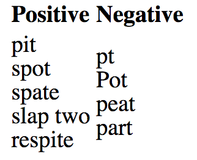

```{r setup, include=FALSE}
knitr::opts_chunk$set(warnings = FALSE, message = FALSE)
library(tidyverse)
```

# Text as data

## Working with text

- Text is an exceedingly complex form of data that is difficult to systematically analyze.
- Two common concepts:
    - *Regular expressions*
    - *Corpora*


# Regular expressions

## Case study: Shakespeare

Project Gutenberg: **www.gutenberg.org**


## Fetching Macbeth {.build}

```{r}
library(mdsr)
library(tidyverse)
macbeth_url <- "http://www.gutenberg.org/cache/epub/1129/pg1129.txt"
macbeth <- read_table("http://www.gutenberg.org/cache/epub/1129/pg1129.txt")
head(macbeth)
```


## {.build}

```{r}
slice(macbeth, 500:530)
```


## Start simple {.build}

Begin by asking very fundamental questions:

1. How long is this play?
2. How many times does Macbeth speak?
3. Who speaks the most?


## {.build}

**1. How long is the play?**

We should be able to get a decent approximation by pulling out any header and footer.

```{r}
macbeth_inner <- macbeth %>%
  slice(271:3171)
dim(macbeth_inner)
```

Can this be improved?


## {.build}

**2. How many times does Macbeth speak?**

```{r}
class(macbeth)
names(macbeth) <- NULL
macbeth <- unlist(macbeth)
class(macbeth)
head(macbeth)
```


## {.build}

**2. How many times does Macbeth speak?**

```{r}
macbeth_lines <- grep("MACBETH", unlist(macbeth), value = TRUE)
length(macbeth_lines)
head(macbeth_lines)
```


## grep(){.build}

- Global regular expression print
- R function and command-line tool
- Needle in haystack paradigm
- Patterns specified through *regular expressions*

```{r eval = FALSE}
grep(pattern = "MACBETH", x = unlist(macbeth), value = TRUE)
```

If `value = FALSE` (the default), it will return the **indices** of the matches instead of the values themselves.


## Regex {.build}

A syntax to specify a general pattern of interest in text. Often used for searching for matches to the pattern in a text document. The pattern lives inside `" "` and is build up from general elements.

- Character classes
- Quantifiers and Alternation
- Anchors


## Character classes {.build}

- `.` : any character except newline

```{r}
grep("MAC.", macbeth, value = TRUE)[1:3]
grep("MACBETH\\.", macbeth, value = TRUE)[1:3]
```

To **escape** a special character, you must use a backslash (or two in R).


## Character classes {.build}

- `.` : any character except newline
- `\w \d \s` : word, digit, whitespace

```{r}
(a <- macbeth[510])
(a <- unlist(strsplit(a, "\\.")))
grep("\\s", a, value = TRUE)
```


## Character classes {.build}

- `.` any character except newline
- `\w \d \s` : word, digit, whitespace
- `[abc]` : any of a, b, or c
- `[^abc]` : not a, b, or c
- `[a-g]` : character between a and g


## Anchors {.build}

- `^` : start of string
- `$` : end of string

```{r}
grep("me$", macbeth, value = TRUE)
```


## Anchors {.build}

- `^` : start of string
- `$` : end of string

```{r}
grep("\\sme$", macbeth, value = TRUE)
```


## Quantifiers and alternation {.build}

- `a*`: 0 or more of a
- `a+` : 1 or more of a
- `a?` : 0 or 1 of a
- `a{5}` `a{2,}` : exactly five, two or more a

```{r}
tail(grep("\\s{2,}", macbeth, value = TRUE))
```


## Quantifiers and alternation {.build}

- `a*`: 0 or more of a
- `a+` : 1 or more of a
- `a?` : 0 or 1 of a
- `a{5}` `a{2,}` : exactly five, two or more a
- `ab|cd` : match ab or cd


## Quantifiers and alternation {.build}

```{r}
grep("Thane of [F|G]", macbeth, value = TRUE)
```


## Activity 8A {.smaller}

Write out a regular expression that will,

1. Identify all of the times that Lady Macbeth, Macbeth, Lady Macduff or Macduff speak.
2. Match everything in the left column and nothing in the right.



Using the `babynames` data,

3. Find the top ten boys' names that end in a vowel.
4. Create two top ten lists - one for boys and one for girls - for names ending with "joe", "jo", "Joe", or "Joe".
5. Find the name/names that involve the greatest number of consecutive consonants.


## Protip


## Start simple

Begin by asking very fundamental questions:

1. How long is this play?
2. How many times does Macbeth speak?
3. Who speaks the most?


## {.build}

**2. How many times does Macbeth speak?**

```{r}
mac_speaks <- grep("^MACBETH\\.", macbeth, value = TRUE)
head(mac_speaks)
length(mac_speaks)
```


## {.build}

**3. Who speaks the most?**

Focus on four characters and use `grepl()` to return a logical vector.

```{r}
Macbeth <- grepl("^MACBETH\\.", macbeth)
LadyMacbeth <- grepl("^LADY MACBETH\\.", macbeth)
Banquo <- grepl("^BANQUO\\.", macbeth)
Duncan <- grepl("^DUNCAN\\.", macbeth)
```


##

Sketch goal


## {.build}

```{r}
data.frame(Macbeth, LadyMacbeth, Banquo, Duncan) %>%
  mutate(line = 1:length(macbeth)) %>%
  gather(key = "character", value = "speak", -line)
```


## {.build}

```{r}
speaker_freq <- data.frame(Macbeth, LadyMacbeth, Banquo, Duncan) %>%
  mutate(line = 1:length(macbeth)) %>%
  gather(key = "character", value = "speak", -line) %>%
  mutate(speak = as.numeric(speak)) %>%
  filter(line > 218, line < 3712)
speaker_freq
```


## {.build}

```{r eval = FALSE}
ggplot(speaker_freq, aes(x = line, y = speak)) +
  geom_smooth(aes(col = character), method = "loess", se = FALSE, span = .4) +
  ylim(c(0, NA)) + xlab("Line Number") + ylab("Proportion of Speeches")
```


## {.build}

```{r echo = FALSE}
ggplot(speaker_freq, aes(x = line, y = speak)) +
  geom_smooth(aes(col = character), method = "loess", se = FALSE, span = .4) +
  ylim(c(0, NA)) + xlab("Line Number") + ylab("Proportion of Speeches")
```


## Adding context {.build}

We can add in the act markers by extracting those line numbers.

```{r}
(acts_idx <- grep("^ACT [I|V]+", macbeth))
(acts_labels <- str_extract(macbeth[acts_idx], "^ACT [I|V]+"))
acts <- data.frame(line = acts_idx, labels = acts_labels)
```


## {.build}

```{r eval = FALSE}
ggplot(speaker_freq, aes(x = line, y = speak)) +
  geom_smooth(aes(col = character), method = "loess", se = FALSE, span = .4) +
  ylim(c(0, NA)) + xlab("Line Number") + ylab("Proportion of Speeches") +
  geom_vline(xintercept = acts_idx, color = "darkgray", lty = 3) +
  geom_text(data = acts, aes(y = 0.085, label = labels),
            hjust = "left", color = "darkgray")
```


## Activity 8B

Select a different Shakespeare play and answer the same three questions.

1. How long is this play?
2. How many times does Macbeth speak?
3. Who speaks the most?

Instead of worry about bringing in URLs, use a package.

```{r eval = FALSE}
library(gutenbergr)
gutenberg_works(author == "Shakespeare, William")
gutenberg_works(title == "Macbeth")
macbeth <- gutenberg_download(1533)
```


