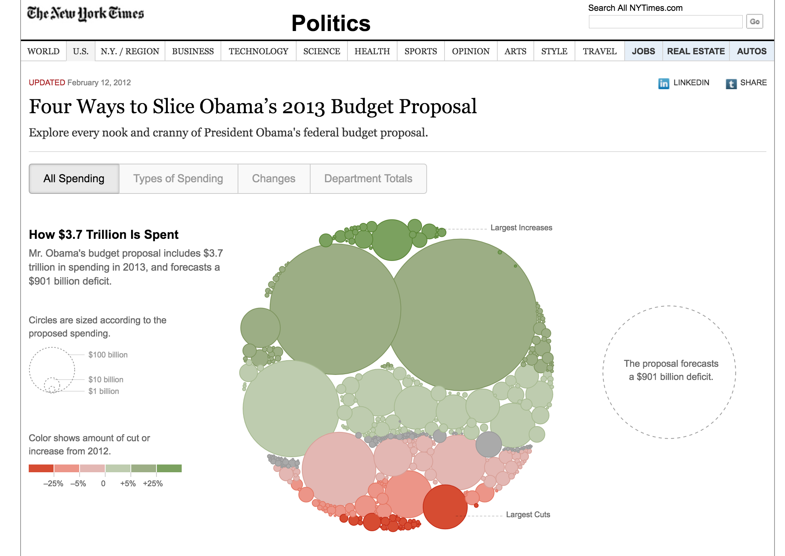
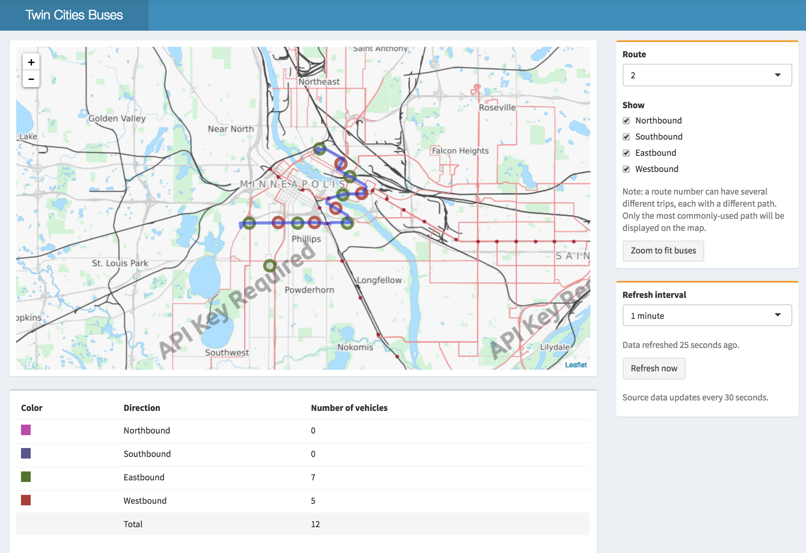

```{r setup, include=FALSE}
knitr::opts_chunk$set(warnings = FALSE, message = FALSE)
library(tidyverse)
```

# Introducing Shiny

##


- R package that makes it easy to build interactive web apps straight from R.
- Let users interact with your data and your analysis.
- Host standalone apps on a webpage or embed them in R Markdown documents or build dashboards.


## Paradigms for interactive viz {.build}

### javascript (d3)

- Very flexible UI.
- No backend; computing is done in browser

### R Shiny

- More constrained UI, very flexible backend
- Computing is done on server.


## 




## 




## `ui` and `server` {.build}

Every shiny app has two components.

### `ui`
- Describes how the webpage will be laid out.
- Handles user input.

### `server`
- Takes input and handles calculations and plot generation.
- A slightly tinkered with R script.

All information that is passed back and forth between these components lives in `input` and `output`.


## Shiny architecture


# App 1: app structure

## App 1: linking `ui` and `server` {.build}

### Goals
- Create two `ggplots`
- Create simple webpage layout to display plots
- Add user input options to webpage
- Use input to modify plots


##

### Add input

Paste the following code where it says “Add User Interface Element here” in `app.R`. If you run the app again, you should see a control, but it doesn’t change the plot.

```{r eval = FALSE}
selectInput("color_opts", "Select Category to Color With",
        choices = select_color_options)
```

### Connect to plot

Change the color aesthetic to the following:

```{r eval = FALSE}
color = input$color_opts
```

### Extend

Add a second input categority and it link to a plot.


## What we know

- The architecture of shiny apps
- How `ui` and `server` communicate through `output` and `input`
- How `ui` displays plots (using `plotOutput`)
- Adding a control (a `selectInput`)
- Connecting that control to our plots using `input`


# App 2: Reactives

## Reactives {.build}

**Reactive**: a bit of code that runs whenever the controls that map to it are changed. 

This will allow us to filter the dataset by adjusting a slider.


## 

### Link slider

Add a `dplyr` chain after `biopics` inside the reactive to subset the data set to only include films after the specified date.

### Plug in plot 2

Modify the code for plot 2 so that the subsetting also occurs there.


# App 3: Observe-update

## Observe-update {.build}

`Observe()` a bit of code that runs whenever the controls that map to it are changed, but unlike `reactive()` doesn't output a specific object.

Can be used to update `ui` after data set changes.


##

### Adding an input

Add a `selectInput` to filter on a particular category within our category variable. This requires changing the `ui`, updating the plot in the `server` and updating `observe()` to update the `ui`.


