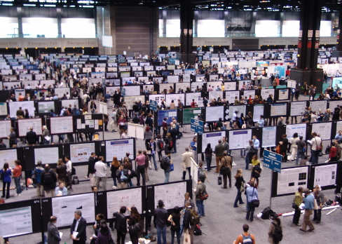
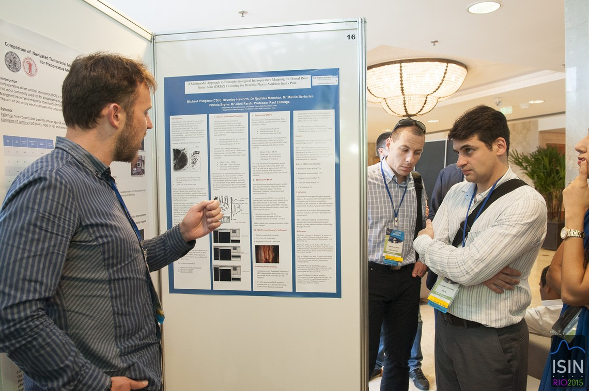
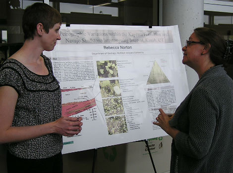

## Symposium Schedule

Thursday, May 10th

- 6 - 6:30: set up and light dinner  
- 6:30 - 7:30: presentations  
- 7:30 - 8:00: poster session

# Presentations {.build}

##

What follows is an example of a bad presentation.

## The "Script" {.build}

**Think about your slides last**

Think about your main message first and outline it

- Start with unambiguous statement of question
- Follow with clear but brief sense of the data
    - What is the unit of observation?
    - List variables?
    - Multiple data sets
- Avoid jargon
- Lay out analytical approach
- Conclude with glimpse of results
- Tell a story but not the whole thing

## The slides {.build}

### Use slides only for things that can't be spoken

- Actually not necessary!
- Also not necessary: your names! (project name is handy though)
- Natural place for data visualization 
    - Use consistent look
    - Revise and revise again to emphasize main story.
- Diagrams/Mock-ups/Schematics/Pseudocode can be powerful.

## Activity

Create a single slide that conveys the structure and context of your data. Things you may want to include:

- Diagram/sketch of the process that generates the data
- Excepted row or two from data set to convey the nature of the observational unit and the variables covered.

## The Presentation {.build}

- Don't face/read slides
- Practice several times
- Be sure to nail first 3 sentences and last 3 sentences
- Consider context of data and audience when shaping your tone
- Stay positive; be careful and constructive

# The Poster Session

##

## The awkward

## The promise

## Navigating a poster session {.build}

**Goal**

Foster *conversation* around your topic.

**Suggestions**

- Encourage their engagement
    - Don't intimidate with a wall of students
    - Allow them time to explore
    - Ask questions
- It may be helpful to restate main Q and data sources

# Timeline

## Symposium Schedule

Thursday, May 10th

- 6:00 - 6:30: set up and light dinner (must arrive by 6:15)
- 6:30 - 7:15: presentations  
- 7:15 - 8:00: poster session

### Deadlines

- Sign up for a [practice talk](https://docs.google.com/document/d/1gdGk8O5U3uCfoWbOY4_3-QZTrtb1zzSeB2giV0vHuKc/edit?usp=sharing) now.
- **Wednesday May 9th, 8 am**: Draft of final deliverable (including well-formatted repo) due.
- **Thursday May 10th, 3 pm**: Final slides must be pushed to GitHub. 
- **Thursday May 10th, 4 - 5 pm**: If shiny, come by Vollum to test hook-up to monitors. 

